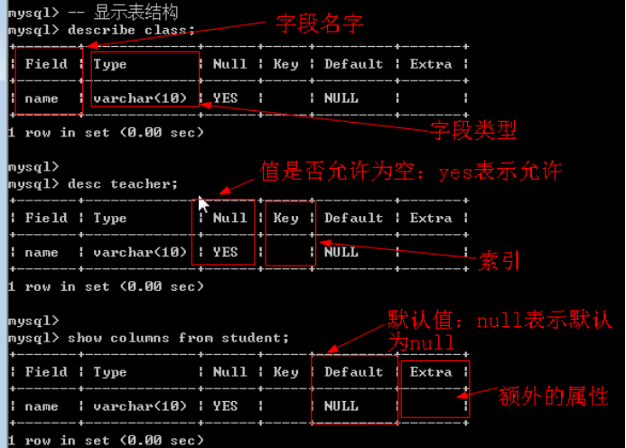

## 数据库概念

数据库(Database)是按照数据结构来组织、存储和管理数据的建立在计算机存储设备上的仓库。

数据库：存储数据的仓库。

## 数据库分类

### 网络数据库

网络数据库是指把数据库技术引入到计算机网络系统中，借助于网络技术将存储于数据库中的大量信息及时发布出去；而计算机网络借助于成熟的数据库技术对网络中的各种数据进行有效管理，并实现用户与网络中的数据库进行实时动态数据交互。

### 层级数据库

层次结构模型实质上是一种有根结点的定向有序树(在数学中"树"被定义为一个无回的连通图)。

### 关系数据库

关系数据库，是建立在关系模型基础上的数据库，借助于集合代数等数学概念和方法来处理数据库中的数据。

数据库的另外一种区分方式：基于存储介质

存储介质分为两种：磁盘和内存

关系型数据库：存储在磁盘中

非关系型数据库：存储在内存中、

## 关系型数据库

### 基本概念

关系数据库，是建立在关系模型基础上的数据库，借助于集合代数等数学概念和方法来处理数据库中的数据。现实世界中的各种实体以及实体之间的各种联系均用关系模型来表示。关系模型是由埃德加·科德于 1970 年首先提出的，并配合“科德十二定律”。现如今虽然对此模型有一些批评意见，但它还是数据存储的传统标准。关系模型由关系数据结构、关系操作集合、关系完整性约束三部分组成。

关系数据结构：指的数据以什么方式来存储，是一种二维表的形式存储。

本质：二维表

| 姓名 | 年龄 | 身高 | 体重 |
| ---- | ---- | ---- | ---- |
| 张三 | 30   | 187  | 70   |
| 李四 | 40   |      |      |

关系操作集合：如何来关联和管理对应的存储数据，`SQL` 指令

获取张三的年纪：已知条件为姓名

Select 年龄 from 二维表 where 姓名 = 张三；

关系完整性约束：数据内部有对应的关联关系，以及数据与数据之间也有对应的关联关系

| 姓名 | 年龄 | 身高 | 体重 |
| ---- | ---- | ---- | ---- |
| 张三 | 30   | 187  | 70   |
| 李四 | 40   |      |      |

表内约束：对应的具体列只能放对应的数据（不能乱放）

表间约束：自然界各实体都是有着对应的关联关系（外键）

### 典型关系型数据库

Oracle、DB2、Microsoft SQL Server、Microsoft Access、MySQL、SQLite

小型关系型数据库：Microsoft Access，SQLite

中型关系型数据库：SQL Server，Mysql

大型关系型数据库：Oracle，DB2

Mysql 当前跟 Oracle 是一个公司的：隶属于 Oracle

## SQL 介绍

### SQL 基本介绍

结构化查询语言(Structured Query Language)简称 SQL，是一种特殊目的的编程语言，是一种数据库查询和程序设计语言，用于存取数据以及查询、更新和管理关系数据库系统；同时也是数据库脚本文件的扩展名。

SQL 就是专门为关系型数据库而设计出来的。

### SQL 分类

1、数据查询语言（DQL:Data Query Language）：

其语句，也称为“数据检索语句”，用以从表中获得数据，确定数据怎样在应用程序给出。保留字 SELECT 是 DQL（也是所有 SQL）用得最多的动词，其他 DQL 常用的保留字有 WHERE，ORDER BY，GROUP BY 和 HAVING。这些 DQL 保留字常与其他类型的 SQL 语句一起使用。

专门用于查询数据：代表指令为 select/show

2、数据操作语言（DML：Data Manipulation Language）：

其语句包括动词 INSERT，UPDATE 和 DELETE。它们分别用于添加，修改和删除表中的行。也称为动作查询语言。

专门用于写数据：代表指令为 insert，update 和 delete

3、事务处理语言（TP/cL）：

它的语句能确保被 DML 语句影响的表的所有行及时得以更新。TPL 语句包括 BEGIN TRANSACTION，COMMIT 和 ROLLBACK。（不是所有的关系型数据库都提供事务安全处理）

专门用于事务安全处理：transaction

4、数据控制语言（DCL）：

它的语句通过 GRANT 或 REVOKE 获得许可，确定单个用户和用户组对数据库对象的访问。某些 RDBMS 可用 GRANT 或 REVOKE 控制对表单个列的访问。

专门用于权限管理：代表指令为 grant 和 revoke

5、数据定义语言（DDL）：

其语句包括动词 CREATE 和 DROP。在数据库中创建新表或删除表（CREAT TABLE 或 DROP TABLE）；为表加入索引等。DDL 包括许多与人数据库目录中获得数据有关的保留字。它也是动作查询的一部分。

专门用于结构管理：代表指令 create 和 drop（alter）

### MySQL 基本介绍

MySQL 是一个关系型数据库管理系统，由瑞典 MySQL AB 公司开发，目前属于 Oracle 旗下产品。MySQL 是最流行的关系型数据库管理系统之一，在 WEB 应用方面，MySQL 是最好的 RDBMS (Relational Database Management System，关系数据库管理系统) 应用软件。

AB 公司被 Sun 公司收购---》Oracle 又收购了 Sun 公司

1、Mysql 是一种开源免费的数据库产品

2、Mysql 对 node 支持是最好的，对 java 的支持也很好

Mysql 中用到的操作指令就是 SQL 指令

#### 启动和停止 MySQL 服务

Mysql 是一种 C/S 结构：客户端和服务端

服务端对应的软件：Mysqld.exe

#### 命令行方式

通过 Windows 下打开 cmd 控制器，然后使用命令进行管理

Net start 服务（mysql）：开启服务

Net stop mysql：关闭服务

#### 系统服务方式

前提：在安装的 Mysql 的时候将 mysql 添加到 Windows 的服务中去了

方式 1 进入服务：

方式 2 进入服务：通过命令行：services.msc

通过服务对 Mysql 服务器进行管理

方案 1：右键服务，然后选择开启或者停止

方案 2：双击服务，进入到服务详情界面，可以点击开启或者停止按钮

#### 登录和退出 MySQL 系统

通过客户端（mysql.exe）与服务器进行连接认证，就可以进行操作

通常：服务端与客户端不在同一台电脑上

##### 登录

1、找到 mysql.exe（通过 cmd 控制台：如果在安装的时候指定了 mysql.exe 所在的路径为环境变量，就可以直接访问；如果没有，那么就必须进入到 mysql.exe 所在路径）

2、输入对应的服务器地址：-h：host -h[IP 地址/域名]

3、输入服务器中 Mysql 监听的端口： -P:port –P:3306

4、输入用户名：-u:username -u:root

5、输入密码：-p：password –p：root

连接认证基本语法：

Mysql.exe/mysql -h 主机地址 -P 端口 -u 用户名 -p 密码

注意事项

1、 通常端口都可以默认：mysql 坚挺的端口通常都是 3306

2、 密码的输入可以先输入-p，直接换行，然后再以密文方式输入密码

##### 退出

断开与服务器的连接：通常 Mysql 提供的服务器数量有限，一旦客户端用完，建议就应该断开连接。

建议方式：使用 SQL 提供的指令

Exit; //exit 带分号

\q; //quit 缩写

Quit：

#### Mysql 服务端架构

Mysql 服务端架构有以下几层构成：

1、数据库管理系统（最外层）：DBMS，专门管理服务器端的所有内容

2、数据库（第二层）：DB，专门用于存储数据的仓库（可以有很多个）

3、二维数据表（第三层）：Table，专门用于存储具体实体的数据

4、字段（第四层）：Field，具体存储某种类型的数据（实际存储单元）

数据库中常用的几个关键字

Row：行

Column：列（field）

## 数据库基本操作

数据库是数据存储的最外层（最大单元）

### 创建数据库

基本语法：create database 数据库名字 [库选项];

库选项：数据库的相关属性

字符集：charset 字符集，代表着当前数据库下的所有表存储的数据默认指定的字符集（如果当前不指定，那么采用 DBMS 默认的）

校对集：collate 校对集

Create database 数据库名字 charset 字符集名称;

### 显示数据库

每当用户通过 SQL 指令创建一个数据库，那么系统就会产生一个对应的存储数据的文件夹（data）

其实，每个数据库文件夹下都有一个 opt 文件，保存的是对应的数据库选项。

#### 显示全部

基本语法：show databases;

#### 显示部分

基本语法：show databases like ‘匹配模式’;

\_：匹配当前位置单个字符

%：匹配指定位置多个字符

获取以 my 开头的全部数据库： ‘my%’;

获取 m 开头，后面第一个字母不确定，最后为 database 的数据库；’m_database’;

获取以 database 结尾的数据库：’%database’;

#### 显示数据库创建语句

基本语法：show create database 数据库名字;

### 选择数据库

为什么要选择数据库？因为数据是存储到数据表，表存在数据库下。如果要操作数据，那么必须进入到对应的数据库才行。

基本语法：use 数据库名字;

### 修改数据库

修改数据库字符集(库选项)：字符集和校对集

基本语法：alter database 数据库名字 charset = 字符集;

一旦修改成功，那么对应的 opt 文件中就会体现

是否可以修改数据库名字？mysql5.5 之前是可以修改的 rename 命令；但是 5.5 之后就不可以。

### 删除数据库

基本语法：drop database 数据库名字;

删除虽简单，但是切记要做好安全操作：确保里面数据没有问题。（重要）

删除数据库之后：对应的存储数据的文件夹也会被删除（opt 文件也被删除）

## 数据表操作

### 创建数据表

#### 普通创建表

基本语法：create table 表名(字段名 字段类型 [字段属性], 字段名 字段类型 [字段属性],…) [表选项]

以上错误说明：表必须放到对应的数据库下：有两种方式可以将表挂入到指定的数据库下

1、 在数据表名字前面加上数据库名字，用“.”连接即可：数据库.数据表

2、在创建数据表之前先进入到某个具体的数据库即可：use 数据库名字;

表选项：与数据库选项类似

Engine：存储引擎，mysql 提供的具体存储数据的方式，默认有一个 innodb（5.5 以前默认是 myisam）

Charset：字符集，只对当前自己表有效（级别比数据库高）

Collate：校对集

#### 复制已有表结构

从已经存在的表复制一份（只复制结构：如果表中有数据不复制）

基本语法：create table 新表名 like 表名;

只要使用数据库.表名，就可以在任何数据库下访问其他数据库的表名

### 显示数据表

每当一张数据表创建，那么就会在对应的数据库下创建一些文件（与存储引擎有关）

注意：这个结构文件来自于 innodb 存储引擎，innodb 存储引擎所有的文件都存储在外部的 ibdata 文件中

#### 显示所有表

基本语法：show tables;

#### 匹配显示表

基本语法：show tables like ‘匹配模式’;

### 显示表结构

本质含义：显示表中所包含的字段信息（名字，类型，属性等）

Describe 表名

Desc 表名

show columns from 表名

### 显示表创建语句

查看数据表创建时的语句：此语句看到的结果已经不是用户之前自己输入的。

基本语法：show create table 表名;

Mysql 中有多种语句结束符

;与\g 所表示的效果是一样的，都是字段在上排横着，下面跟对应的数据

\G 字段在左侧竖着，数据在右侧横着

### 设置表属性

表属性指的就是表选项：engine，charset 和 collate

基本语法：alter table 表名 表选项 [=] 值;

注意：如果数据库已经确定了，里面有很多数据了，不要轻易修改表选项（字符集影响不大）

### 修改表结构

修改表名：rename table 旧表名 to 新表名

修改表选项：alter table 表名 表选项 [=] 新值

新增字段：alter table 表名 add [column] 新字段名 列类型 [列属性][位置 first/after 字段名]

字段位置：字段想要存放的位置

First：在某某之前（最前面），第一个字段

After 字段名：放在某个具体的字段之后（默认的）

修改字段名：alter table 表名 change 旧字段名 新字段名 字段类型 [列属性][新位置]

修改字段类型（属性）：alter table 表名 modify 字段名 新类型 [新属性][新位置]

删除字段：alter table 表名 drop 字段名

### 删除表结构

基础语法：drop table 表名[,表名 2…]，可以同时删除多个数据表

批量删除表

## 数据基础操作

### 插入操作

本质含义：将数据以 SQL 的形式存储到指定的数据表（字段）里面

基本语法：向表中指定字段插入数据

Insert into 表名[(字段列表)] values(对应字段列表)

1、 注意：后面（values 中）对应的值列表只需要与前面的字段列表相对应即可（不一定与表结构完全一致）

2、 注意：字段列表并不一定非要有所有的表中字段

基本语法：向表中所有字段插入数据

Insert into 表名 values（对应表结构）

值列表必须与字段列表一致

### 查询操作

查询表中全部数据：select \* from 表名;

\*表示匹配所有的字段

查询表中部分字段：select 字段列表 from 表名;

字段列表使用逗号“,”隔开

简单条件查询数据：select 字段列表/\* from 表名 where 字段名 = 值; //mysql 中没有==符号

### 删除操作

基本语法：delete from 表名 [where 条件]; //如果没有 where 条件：意味着系统会自动删除该表所有数据（慎用）

### 更新操作

更新：将数据进行修改（通常是修改部分字段数据）

基本语法：update 表名 set 字段名 = 新值 [where 条件];//如果没有 where 条件，那么所有的表中对应的那个字段都会被修改成统一值。

## 字符集

### 字符编码概念

字符(Character)是各种文字和符号的总称，包括各国家文字、标点符号、图形符号、数字等。

在计算机中所看到的任何内容都是字符构成的。

字符编码（character code）是计算机针对各种符号，在计算机中的一种二进制存储代号。

### 字符集概念

字符集(Character set)是多个字符的集合，字符集种类较多，每个字符集包含的字符个数不同。

常见字符集名称：ASCII 字符集、GB2312 字符集、BIG5 字符集、 GB18030 字符集、Unicode 字符集等。计算机要准确的处理各种字符集文字，需要进行字符编码，以便计算机能够识别和存储各种文字。中文文字数目大，而且还分为简体中文和繁体中文两种不同书写规则的文字，而计算机最初是按英语单字节字符设计的，因此，对中文字符进行编码，是中文信息交流的技术基础。

### 设置客户端所有字符集

如果直接通过 cmd 下的 mysql.exe 进行中文数据插入，那么可能出错

出错原因：

1、 用户是通过 mysql.exe 来操作 mysqld.exe

2、 真正的 SQL 执行是 Mysqld.exe 来执行

3、 mysql.exe 将数据传入 mysqld.exe 的时候，没有告知其对应的符号规则（字符集），而 mysqld 也没有能力自己判断，就会使用自己默认的（字符集）

解决方案：mysql.exe 客户端在进行数据操作之前将自己所使用的字符集告诉 mysqld

Cmd 下的 mysql.exe 默认都只有一个字符集：GBK

Mysql.exe 如果告知 Mysqld.exe 对应的字符集类型为 gbk？

快捷方式：set names 字符集

重新进行数据插入：中文（GBK）

深层原理：客户端，服务端，连接层（show variables like ‘character*set*%’）

Mysql.exe 与 Mysqld.exe 之间的处理关系一共分为三层

客户端传入数据给服务端：client:character_set_client

服务端返回数据给客户端：server:character_set_results

客户端与服务端之间的连接：connection:character_set_connection

Set names 字符集的本质：就是一次性打通三层关系的字符集，变得一致。

在系统中有三个变量来记录着这三个关系对应的字符集：show variables like ‘character*set*%’;

查看一个新的客户端的对应的字符集关系

修改服务器端变量的值

Set 变量名 = 值;

重新进行数据插入和查看的结果：插入 OK，但是查看乱码

修改结果字符集为 GBK

Connection 只是为了更方便客户端与服务端进行字符集转换而设。

Set names gbk;

Set character_set_client = gbk; //为了让服务器识别客户端传来的数据

Set character_set_connection = gbk;//更好的帮助客户端与服务端之间进行字符集转换

Set character_set_results = gbk;//为了告诉客户端服务端所有的返回的数据字符集
