## Git 指令

### 创建

**git 中打开创建的 git 命令练习库**

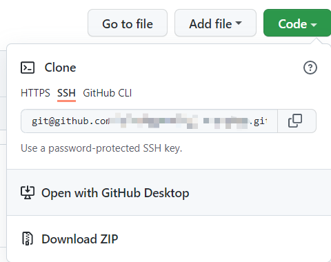

#### git clone xxxx

克隆 github 上的库到本地

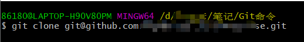

**成功克隆**

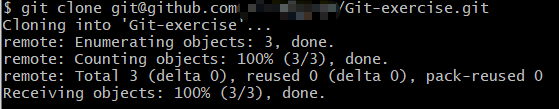

在 git 的路径上会出现你克隆下来的文件夹

因为这是我自己创建的库，里面没有什么东西，如果克隆别人项目的库别人库内的东西相应会被克隆到本地

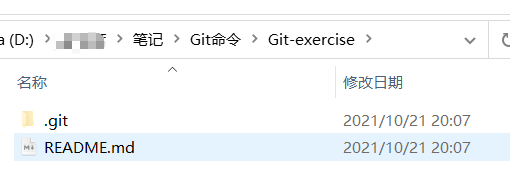

#### **git init**

命令用于在目录中创建新的 Git 仓库。

克隆到本地，会在当前文件夹中出现.git 文件夹

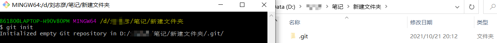

### 本地修改

#### **git status**

命令用于查看在你上次提交之后是否有对文件进行再次修改。

为了方便测试，新增了一个 html 文件，并进行修改

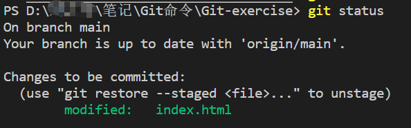 、

##### git status -s

能获得简短的输出结果，直接明了

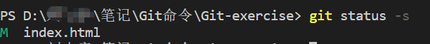

#### git diff

查看尚未缓存的改动

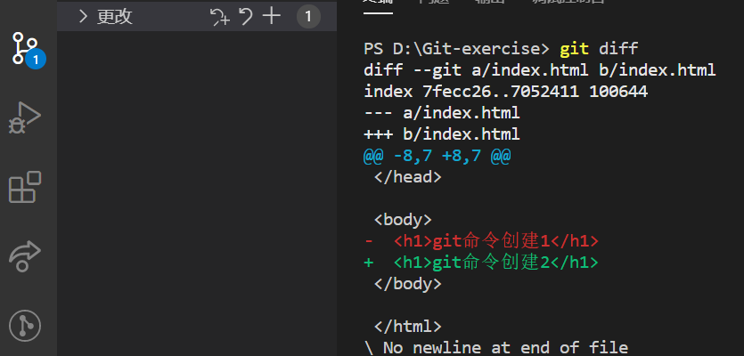

##### **git diff --cached**

查看已缓存的改动

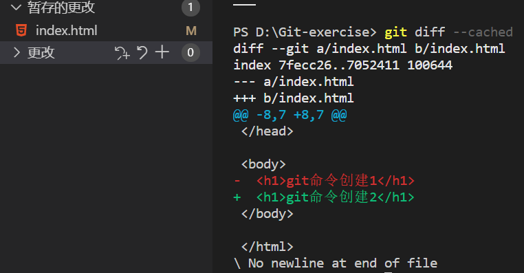

#### git add .

命令可将所有修改添加到暂存区，并添加到下次提交中

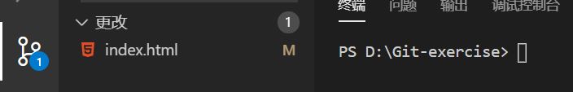

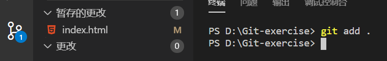

##### git add <文件名>

将指定文件添加到暂存区

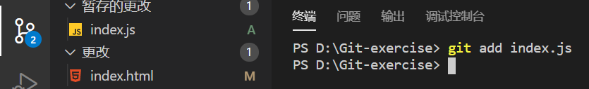

#### git commit

将暂存区内容添加到本地仓库中。

##### git commit -m <备注信息>

提交暂存区中所有修改文件到本地仓库中

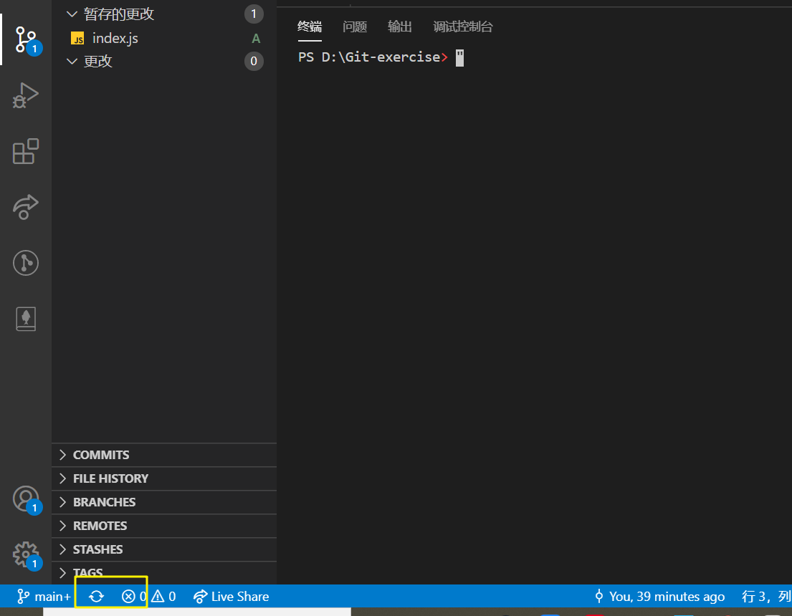

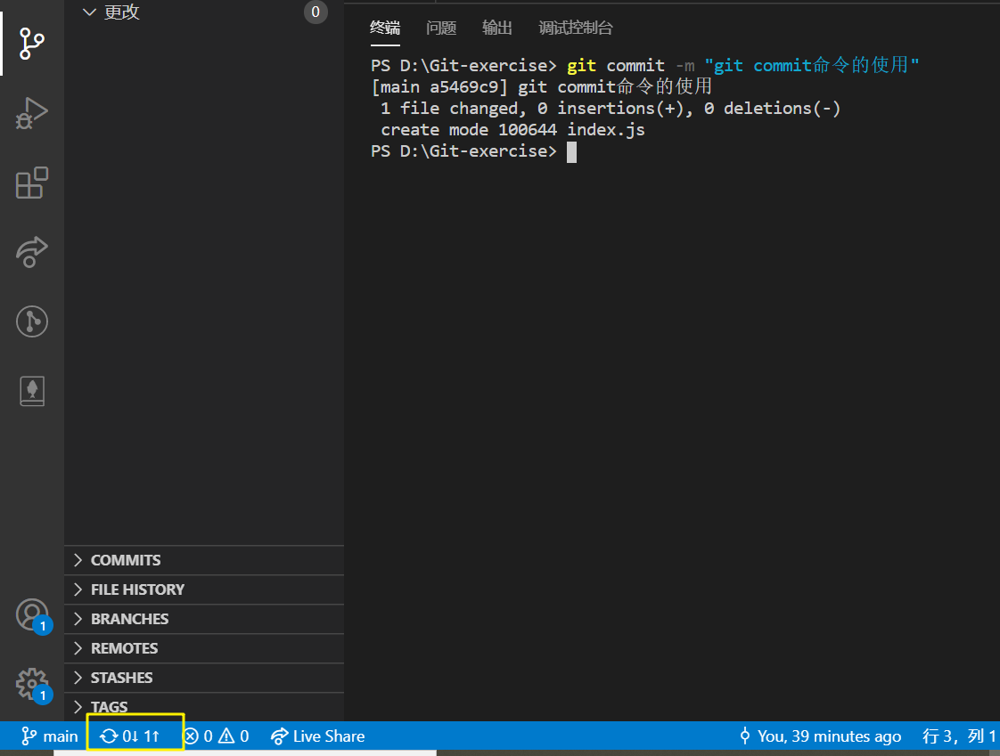

##### git commit <文件名> -m <备注信息>

提交暂存区的指定文件到仓库区

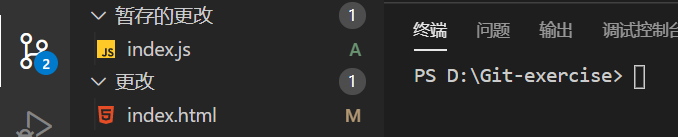

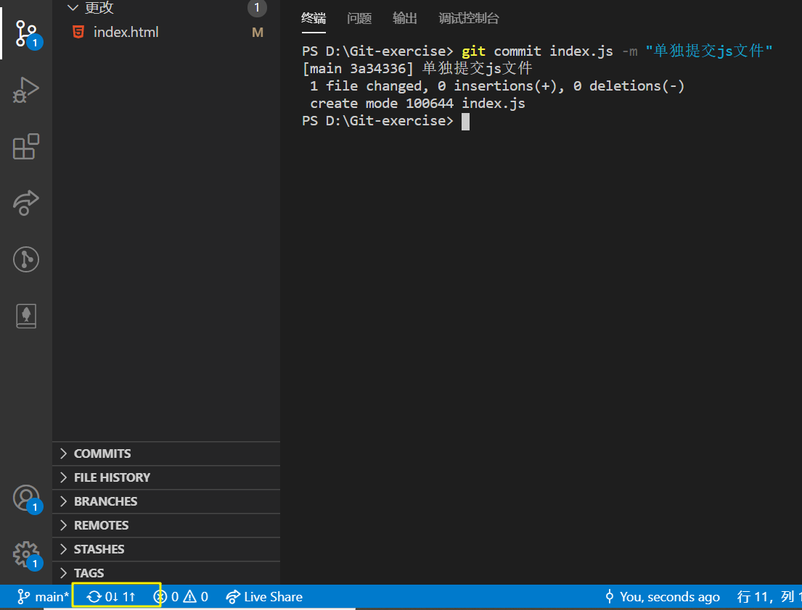

### 提交历史

#### git log

查看历史提交记录。

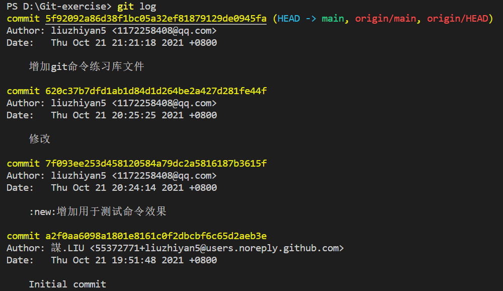

##### git log --oneline

可查看简洁明了的提交历史记录

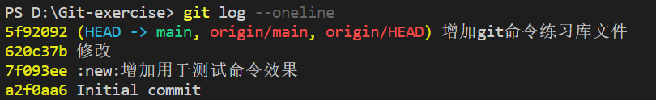

##### git log <文件名>

能查看指定文件的提交历史记录

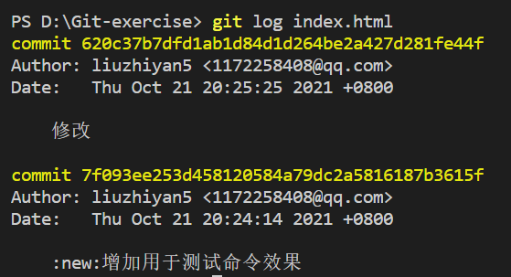

#### git blame <文件名>

查看指定文件的修改记录

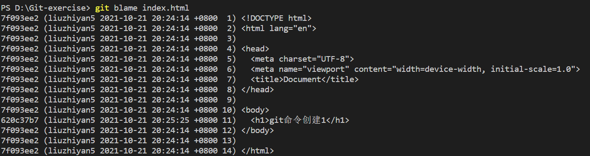

虽然 `git log` 和 `git blame` 都有能够查看文件提交记录的功能，但通过实现就能查看他们之间的不同

### 分支和标签

#### git branch

显示所有分支

##### git branch <分支名>

创建一个新分支

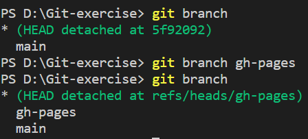

##### git branch -d <分支名>

删除本地指定分支

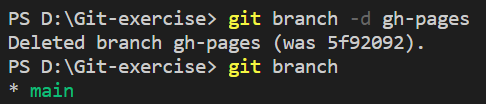

#### git checkout

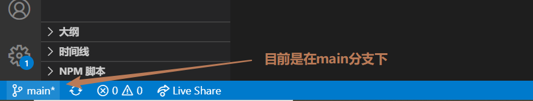

##### git checkout <分支名>

切换到指定的分支上

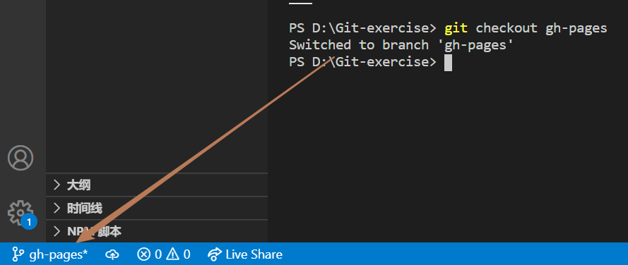

##### git checkout --track <远程分支名>

在 github 上的库中创建第二分支

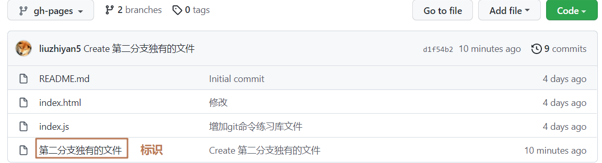

但是在 github 上创建的分支，在本地上 push 等操作是无法进行追踪的

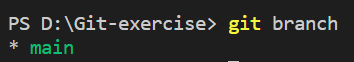

可见此时本地分支也只有 main

那么如何将远程分支 gh-pages 拉取到本地同名分支呢？

方法有很多，我这只是其中一种

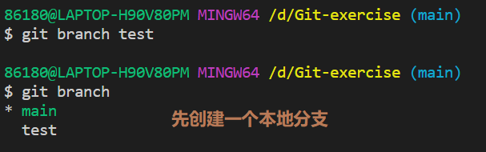

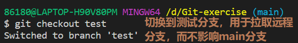

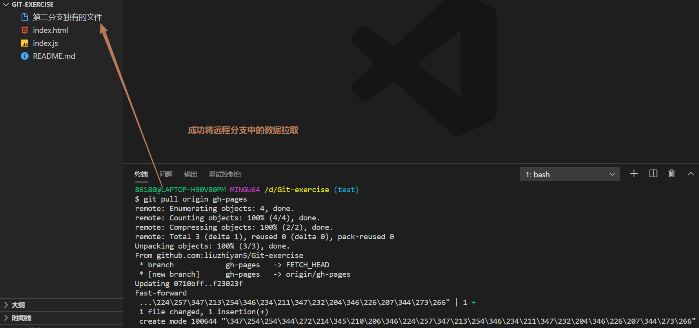

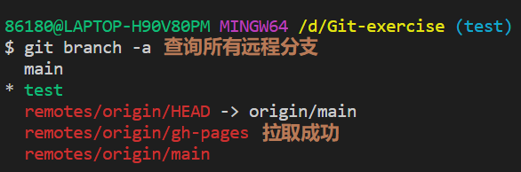

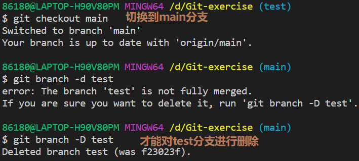

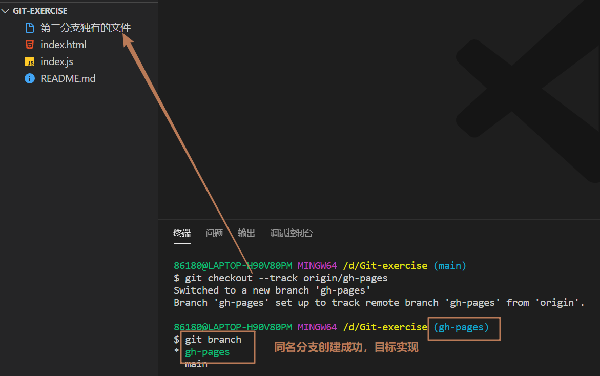

#### 题外话

##### git remote prune <克隆的仓库服务器名字，默认是 origin>

删除本地仓库中存储下来的远程分支
