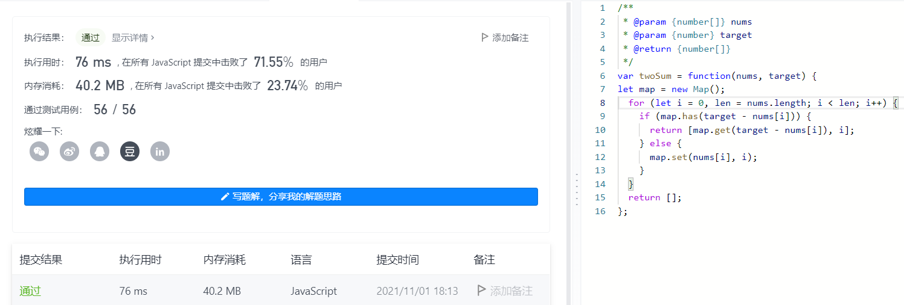

# 两数之和

给定一个整数数组 `nums` 和一个整数目标值 `target`，请你在该数组中找出 **和为目标值** _`target`_ 的那 **两个** 整数，并返回它们的数组下标。

## 题目

```text
示例 1：
输入：nums = [2,7,11,15], target = 9
输出：[0,1]
解释：因为 nums[0] + nums[1] == 9 ，返回 [0, 1]。

示例 2：
输入：nums = [3,2,4], target = 6
输出：[1,2]

示例 3：
输入：nums = [3,3], target = 6
输出：[0,1]
```

### 暴力算法

```js
var twoSum = function(nums, target) {
  let flag = true;
  let spaceArr;

  nums.map((item, i) => {
    nums.map((ele, y) => {
      // 因为只显示第一次正确的相加，所以制定一个开关
      // 当得出第一个正确相加的答案时，将开关变为false
      if (item + ele == target && flag && i != y) {
        flag = false;
        spaceArr = [i, y];
      }
    });
  });

  return spaceArr;
};

console.log(twoSum([3, 2, 4, 3], 6)); // [ 0, 3 ] 成功
```


### new Map()初识

```js
let map = new Map(); // 创建一个对象
let map1 = new Map();
let aa;

// 往map中存入数据
map.set("年龄", 18);

console.log(map); // Map { '年龄' => 18 }
console.log(map.get("年龄")); // 18
console.log(map.has("年龄")); // true
console.log(map.has("性别")); // false

for (let i = 0; i < 3; i++) {
  // 能够记住键的原始插入顺序，任何值(对象或者原始值) 都可以作为一个键或一个值。
  map1.set(["第一个数", "第二个数", "第三个数"][i], i);

  aa = map1.get(["第一个数", "第二个数", "第三个数"][i]);

  console.log(aa); // 分别是：0 1 2
}

console.log(map1); // Map { '第一个数' => 0, '第二个数' => 1, '第三个数' => 2 }
```

### 较好的写法

```js
var twoSum = function(nums, target) {
  // 创建出一个对象，并且能够记住键的原始插入顺序
  let map = new Map();

  for (let i = 0, len = nums.length; i < len; i++) {
    // console.log(map)
    // 分别打印出来的结果：
    // 1 -> Map {}
    // 2 -> Map { 2 => 0 }
    // 3 -> [ 0, 1 ]

    // map.has()的作用是判断该对象是否有指定的键
    if (map.has(target - nums[i])) {
      // 获取键
      // 得出的答案获取
      return [map.get(target - nums[i]), i];
    } else {
      // 添加键
      // 意义在于，将给函数传入的数组遍历出它每个值，添加进map中当做对象的键
      // 因为我们第二个参数是我们需要的和，那么我们将这个和，减去遍历出来的当前的值，那么就是我们需要的键
      // 如果map对象中有这个键，那么就获取这个键所指向的索引
      map.set(nums[i], i); // {传入数组的值 => 它的索引}
    }
  }

  // 这里这个return的作用在于，如果没有答案则返回空数组
  return [];
};

console.log(twoSum([2, 7, 1, 8], 9));
```



## 参考文档

[认识 Map](https://developer.mozilla.org/zh-CN/docs/Web/JavaScript/Reference/Global_Objects/Map)

[JavaScript Array map() 方法](https://www.runoob.com/jsref/jsref-map.html)
