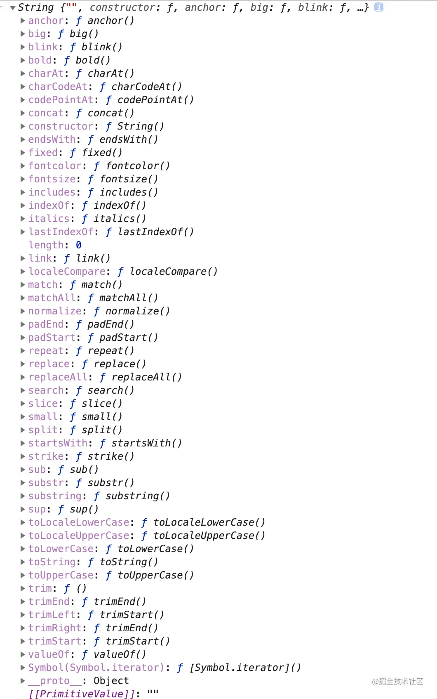

# 1.字符串（一）



## 一、查找判断

### 1.1 charAt

> `charAt()` 方法从一个字符串中返回指定的字符。
>
> ```
> str.charAt(index)
> ```

- `@params`：一个介于 0 和字符串长度减 1 之间的整数。 (0~length-1)，默认 0。
- `@return`：字符
- `是否改变原字符串`：不改变

```js
const str = "hello";
console.log(str.charAt(2)); // ?
console.log(str.charAt(5)); // ?
```

### 1.3 indexOf

> `indexOf()` 方法返回调用它的 String 对象中第一次出现的指定值的索引，从 fromIndex 处进行搜索。如果未找到该值，则返回 -1。
>
> ```
> str.indexOf(searchValue [, fromIndex])
> ```

- ```
  @params
  ```

  ：

  - searchValue：是要被查找的字符串值；
  - fromIndex：表示开始查找的位置。可以是任意整数，默认值为 0。

- `@return`：查找的字符串 searchValue 的第一次出现的索引，如果没有找到，则返回 -1。

- `是否改变原字符串`：不改变

```js
console.log("Blue Whale".indexOf("Blue")); // ?
console.log("Blue Whale".indexOf("Blute")); // ?
console.log("Blue Whale".indexOf("Whale", 0)); // ?
console.log("Blue Whale".indexOf("Whale", 5)); // ?
```

### 1.4 lastIndexOf

> `lastIndexOf()` 方法返回调用 String 对象的指定值最后一次出现的索引，在一个字符串中的指定位置 fromIndex 处从后向前搜索。如果没找到这个特定值则返回-1 。
>
> ```
> str.lastIndexOf(searchValue[, fromIndex])
> ```

- ```
  @params
  ```

  ：

  - searchValue：是一个字符串，表示被查找的值。如果 searchValue 是空字符串，则返回 fromIndex。；
  - fromIndex：可选，待匹配字符串 searchValue 的开头一位字符从 str 的第 fromIndex 位开始向左回向查找。

- `@return`：返回指定值最后一次出现的索引(该索引仍是以从左至右 0 开始记数的)，如果没找到则返回 -1。

- `是否改变原字符串`：不改变

```js
const str = "demodemo";
console.log(str.lastIndexOf("m"));
```

### 1.5 startsWith

> `startsWith()` 方法用来判断当前字符串是否以另外一个给定的子字符串开头，并根据判断结果返回 true 或 false。
>
> ```
> str.startsWith(searchString[, position])
> ```

- ```
  @params
  ```

  ：

  - searchString：表示要搜索的子字符串；
  - position：可选，表示在 str 中搜索 searchString 的开始位置，默认值为 0。

- `@return`：如果在字符串的开头找到了给定的字符则返回 true；否则返回 false。

- `是否改变原字符串`：不改变

```js
const str = "Saturday night plans";
console.log(str.startsWith("Sat")); // ?
console.log(str.startsWith("Sat", 3)); // ?
复制代码;
```

### 1.6 endsWith

> `endsWith()` 方法用来判断当前字符串是否是以另外一个给定的子字符串“结尾”的，根据判断结果返回 true 或 false。
>
> ```
> str.endsWith(searchString[, length])
> ```

- ```
  @params
  ```

  ：

  - searchString：表示要搜索的子字符串；
  - length：可选，是 str 的长度。默认值为 str.length。

- `@return`：如果传入的子字符串在搜索字符串的末尾则返回 true，否则将返回 false。

- `是否改变原字符串`：不改变

```js
const str = "hello";

console.log(str.endsWith("o")); // ?
console.log(str.endsWith("o", 4)); // ?
console.log(str.endsWith("e", 2)); // ?
```

### 1.7 includes

> `includes()` 方法用于判断一个字符串是否包含在另一个字符串中，根据情况返回 true 或 false。
>
> ```
> str.includes(searchString[, position])
> ```

- ```
  @params
  ```

  ：

  - searchString：表示要在此字符串中搜索的字符串
  - position：可选，表示从当前字符串的哪个索引位置开始搜寻子字符串，默认值为 0。

- `@return`：如果当前字符串包含被搜寻的字符串，就返回 true；否则返回 false。

- `是否改变原字符串`：不改变

```js
const str = "To be, or not to be, that is the question.";

console.log(str.includes("To be")); // ?
console.log(str.includes("question")); // ?
console.log(str.includes("nonexistent")); // ?
console.log(str.includes("To be", 1)); // ?
console.log(str.includes("TO BE")); // ?
```

### 1.8 localeCompare

> `localeCompare()` 方法返回一个数字来指示一个参考字符串是否在排序顺序前面或之后或与给定字符串相同。
>
> ```
> referenceStr.localeCompare(compareString[, locales[, options]])
> ```

- ```
  @params
  ```

  ：

  - compareString：表示用来比较的字符串；
  - locales：可选，用来表示一种或多种语言或区域的一个符合 BCP 47 标准的字符串或一个字符串数组。
  - options：可选。

- `@return`：如果引用字符存在于比较字符之前则为负数; 如果引用字符存在于比较字符之后则为正数; 相等的时候返回 0。

- `是否改变原字符串`：不改变

# 字符串（二）

## 二、截取拼接

### 2.1 concat

> `concat()` 方法将一个或多个字符串与原字符串连接合并，形成一个新的字符串并返回。
>
> ```
> str.concat(str2, [, ...strN])
> ```

- `@params`：需要连接到 str 的字符串。
- `@return`：一个新的字符串，包含参数所提供的连接字符串。
- `是否改变原字符串`：不改变

```js
let hello = "Hello";
console.log(hello.concat("张三", "李四")); // ?

let greetList = ["Hello", " ", "Venkat", "!"];
console.log("".concat(...greetList)); // ?
console.log("".concat(true)); // ?
console.log("".concat(4, 5)); // ?
```

### 2.2 slice

> `slice()` 方法提取某个字符串的一部分，并返回一个新的字符串，且不会改动原字符串。
>
> ```
> str.slice(beginIndex[, endIndex])
> ```

- ```
  @params
  ```

  ：

  - `beginIndex`：从该索引（以 0 为基数）处开始提取原字符串中的字符。如果值为负数，会被当做 `strLength + beginIndex` 看待，这里的`strLength` 是字符串的长度（例如， 如果 beginIndex 是 -3 则看作是：`strLength - 3`）；
  - `endIndex`：可选。在该索引（以 0 为基数）处结束提取字符串。如果省略该参数，slice() 会一直提取到字符串末尾。如果该参数为负数，则被看作是 `strLength + endIndex`，这里的 strLength 就是字符串的长度(例如，如果 endIndex 是 -3，则是, `strLength - 3`)。

- `@return`：返回一个从原字符串中提取出来的新字符串。

- `是否改变原字符串`：不改变

```js
let str1 = "good",
  str2 = str1.slice(1, 3),
  str3 = str1.slice(0, -1);
console.log(str2); // 输出：
console.log(str3); // 输出：
```

### 2.3 substr

> `substr()` 方法返回一个字符串中从指定位置开始到指定字符数的字符。(如果可以的话，使用 substring() 替代它)
>
> ```
> str.substr(start[, length])
> ```

- ```
  @params
  ```

  ：

  - start：开始提取字符的位置。如果为负值，则被看作 strLength + start，其中 strLength 为字符串的长度（例如，如果 start 为 -3，则被看作 strLength + (-3)）。
  - length：可选，提取的字符数。

- `@return`：一个字符串中从指定位置开始到指定字符数的字符。

- `是否改变原字符串`：不改变

```js
let str = "abcdefghij";

console.log("(1,2): " + str.substr(1, 2)); //
console.log("(-3,2): " + str.substr(-3, 2)); //
console.log("(-3): " + str.substr(-3)); //
console.log("(1): " + str.substr(1)); //
```

### 2.4 substring

> `substring(start, end)` [satrt, end)

- `@return`：包含给定字符串的指定部分的新字符串。

- `是否改变原字符串`：不改变

```js
let str = "Mozilla";

// 输出
console.log(str.substring(0, 3));

// 输出
console.log(str.substring(1, 3));
```

### 2.5 replace

> `replace()` 方法返回一个由替换值（replacement）替换部分或所有的模式（pattern）匹配项后的新字符串。模式可以是一个字符串或者一个正则表达式，替换值可以是一个字符串或者一个每次匹配都要调用的回调函数。**如果 pattern 是字符串，则仅替换第一个匹配项**。
>
> ```
> str.replace(regexp|substr, newSubStr|function)
> ```

- `@return`：一个部分或全部匹配由替代模式所取代的新的字符串。

- `是否改变原字符串`：不改变

利用 `replace()` 进行替换的时候，如果传入的是字符串，则只会替换第一个子字符串，要想替换所有的子字符串，则需要传入一个正则表达式，而且要指定全局（g）标志。

```js
let text = "cat , bat , sat , fat";
let result = text.replace("at", "ond");
console.log(result); // ?

result = text.replace(/at/g, "ond");
console.log(result); //=> ?
```

### 2.6 replaceAll

> `replaceAll()` 方法返回一个新字符串，新字符串所有满足 pattern 的部分都已被 replacement 替换。pattern 可以是一个字符串或一个 RegExp， replacement 可以是一个字符串或一个在每次匹配被调用的函数。
>
> ```
> const newStr = str.replaceAll(regexp|substr, newSubstr|function)
> ```

- `@params`：
- `@return`：一个全部匹配由替代模式所取代的新的字符串。
- `是否改变原字符串`：不改变

```js
"aabbcc".replaceAll("b", ".");
// 'aa..cc'
```

### 2.7 repeat

> `repeat()` 构造并返回一个新字符串，该字符串包含被连接在一起的指定数量的字符串的副本。
>
> ```
> str.repeat(count)
> ```

- `@params`：介于 0 和 +Infinity 之间的整数。表示在新构造的字符串中重复了多少遍原字符串。
- `@return`： 包含指定字符串的指定数量副本的新字符串。
- `是否改变原字符串`：不改变

```js
"abc".repeat(1); //
"abc".repeat(2); //
"abc".repeat(3.5); //
```

# 字符串（三）

## 三、修改转换

### 3.1 split

> `split()` 方法使用指定的分隔符字符串将一个 String 对象分割成子字符串数组，以一个指定的分割字串来决定每个拆分的位置。
>
> ```
> str.split([separator[, limit]])
> ```

- ```
  @params
  ```

  ：

  - separator：指定表示每个拆分应发生的点的字符串。separator 可以是一个字符串或正则表达式。如果分隔符为空字符串，则将 str 原字符串中每个字符的数组形式返回。
  - limit （可选）:一个整数，限定返回的分割片段数量。

- `@return`： 返回源字符串以分隔符出现位置分隔而成的一个 Array。

- `是否改变原字符串`：不改变

```js
let color = "red,blue,yellow,black";
let color1 = color.split(","); // =>['red','blue','yellow','black']
let color2 = color.split(",", 2); // =>['red','blue']
```

### 3.2 toLowerCase

> `toLowerCase()` 会将调用该方法的字符串值转为小写形式，并返回。

### 3.3 toUpperCase

> toUpperCase() 方法将调用该方法的字符串转为大写形式并返回（如果调用该方法的值不是字符串类型会被强制转换）。

## 四、空白字符

### 4.1 trim

> `trim()` 方法会从一个字符串的两端删除空白字符。在这个上下文中的空白字符是所有的空白字符 (space, tab, no-break space 等) 以及所有行终止符字符（如 LF，CR 等）。
>
> ```
> str.trim()
> ```

- `@params`：
- `@return`： 一个代表调用字符串两端去掉空白的新字符串。
- `是否改变原字符串`：不改变

```js
let orig = "   foo  ";
console.log(orig.trim()); //

let orig = "foo    ";
console.log(orig.trim()); //
复制代码;
```

### 4.2 trimStart

> `trimStart()` 方法从字符串的开头删除空格。trimLeft() 是此方法的别名。
>
> ```
> str.trimStart();
> ```

- `@params`：
- `@return`： 一个新字符串，表示从其开头（左端）除去空格的调用字符串。
- `是否改变原字符串`：不改变

```js
let str = " foo ";
console.log(str.length); // ?

str = str.trimStart(); // 等同于 str = str.trimLeft();
console.log(str.length); //
```

### 4.3 trimRight

> `trimEnd()` 方法从一个字符串的末端移除空白字符。trimRight() 是这个方法的别名。
>
> ```
> str.trimEnd();
> ```

- `@params`：
- `@return`： 一个新字符串，表示从调用字串的末（右）端除去空白。
- `是否改变原字符串`：不改变

```js
let str = "foo ";
console.log(str.length); //

str = str.trimRight(); // 或写成str = str.trimEnd();
console.log(str.length); //
console.log(str); //
```
