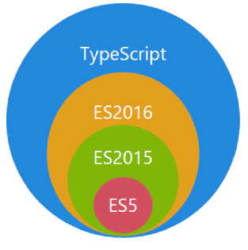
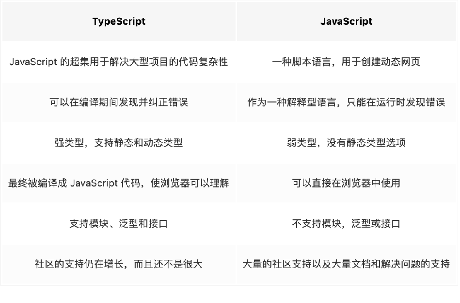
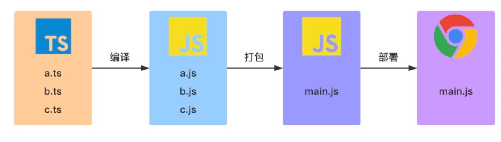

## 为什么要学习 TypeScript

`TypeScript` 是一种由微软开发的自由和开源的编程语言。它是 `JavaScript` 的一个超集，而且本质上向这个语言添加了可选的静态类型和基于类的面向对象编程。
因为 `JavaScript` 是弱类型，很多错误只有在运行时才会被发现，而 `TypeScript` 是强类型，它提供了一套静态检测机制，可以帮助我们在编译时就发现错误。

学习它可以让我们的代码更加健壮，学习它可以让我们减少团队的无效沟通，甚至还会帮助我们快速学习其他后端语言

## TypeScript 与 JavaScript 的区别

TS 和 JS 之间的关系其实就是 Less/Sass 和 CSS 之间的关系
就像 Less/Sass 是对 CSS 进行扩展一样，TS 也是对 JS 进行扩展
就像 Less/Sass 最终会转换成 CSS 一样，我们编写好的 TS 代码最终会编译成 JS

## 典型 TypeScript 工作流程

在上图中包含 3 个 ts 文件：a.ts、b.ts 和 c.ts。这些文件将被 `TypeScript` 编译器，根据配置的编译选项编译成 3 个 js 文件，即 a.js、b.js 和 c.js。对于大多数使用 `TypeScript` 开发的 Web 项目，我们还会对编译生成的 js 文件进行打包处理，然后在进行部署。
