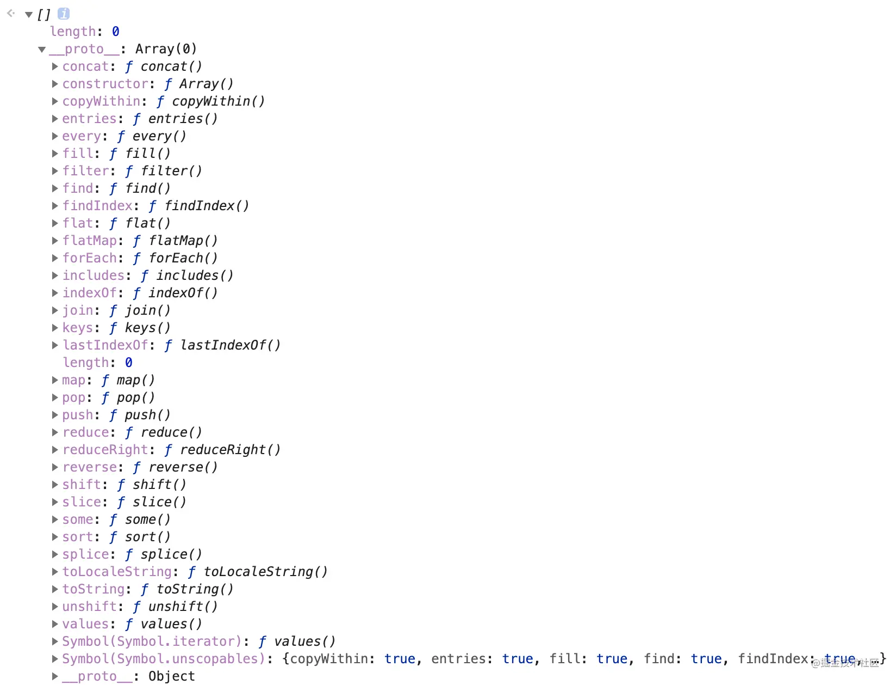

## 数组（一）



### 一、增删查改

#### 1.1 push

> `push()` 方法将一个或多个元素添加到数组的末尾，并返回新数组的长度。
>
> ```
> arr.push(element1, ..., elementN)
> ```

- `@params`：数组要新增的元素（任意数据类型，一次可添加多个，用逗号隔开）
- `@return`：返回数组新增元素后的长度
- `是否改变原数组`：改变

```js
var arr = [1, 2, 3];
var res = arr.push(6, 7, 8);
console.log(res); // ?
console.log(arr); // ?
```

#### 1.2 unshift

> `unshift()` 方法将一个或多个元素添加到数组的开头，并返回该数组的新长度。此方法更改数组的长度。
>
> ```
> arr.unshift(element1, ..., elementN)
> ```

- `@params`：数组要新增的元素（任意数据类型，一次可添加多个，用逗号隔开）
- `@return`：返回数组新增元素后的长度
- `是否改变原数组`：改变

```js
var arr = [1, 2, 3];
var res = arr.unshift(6, 7, 8);

console.log(res); // ?
console.log(arr); // ?
```

#### 1.3 pop

> `pop()` 方法从数组中删除最后一个元素，并返回该元素的值。此方法更改数组的长度。
>
> ```
> arr.pop()
> ```

- `@params`：无
- `@return`：返回数组被删除的元素
- `是否改变原数组`：改变

```js
var arr = [1, 2, 3];
var res = arr.pop();

console.log(res); // ?
console.log(arr); // ?
```

#### 1.4 shift

> `shift()` 方法从数组中删除第一个元素，并返回该元素的值。此方法更改数组的长度。
>
> ```
> arr.shift()
> ```

- `@params`：
- `@return`：
- `是否改变原数组`：改变

```js
var arr = [1, 2, 3];
var res = arr.shift();

console.log(res); // ?
console.log(arr); // ?
```

#### 1.5 splice

> `splice()` 方法
>
> 1. 通过删除或替换现有元素
> 2. 或者原地添加新的元素来修改数组
> 3. 并以数组形式返回被修改的内容。此方法会改变原数组。
>
> ```
> array.splice(start[, deleteCount[, item1[, item2[, ...]]]])
> ```

- `@params`：不限参数， n,m,x,...第一个参数 n 是必传（数组的下标，代表从第 n 个元素起），第二个参数（可选）代表要删除（或被替代，取决于第三个参数是否有值）的元素个数，第三个参数（可选）起，代表要添加（或替代）的元素
- `@return`：返回值是一个数组，里面是删除项
- `是否改变原数组`：改变

```js
// 删除
var arr = [1, 2, 3];
var res = arr.splice(1); // 只传第一个参数，表示删除从下标为 1 的元素起，到最后一个元素
console.log(res); // ?
console.log(arr); // ?
// arr.splice(0)：可以清空数组，把原始数组中的内容基于新数组储存起来（有点类似于数组克隆）
// arr.splice(arr.length-1)：删除最后一项
// arr.splice(0, 1)：删除第一项

// 增加
var arr = [1, 2, 3];
var res = arr.splice(1, 0, 8, 9); // 第二个参数为0，表示不删除，之后的参数表示插进数组，下标从1开始，之前的元素往后挪
console.log(res); // ?
console.log(arr); // ?

// 改（替代）
var arr = [1, 2, 3];
var res = arr.splice(1, 1, 8, 9); // 第二个参数为1，表示替代掉下标为1的元素
console.log(res); // ?
console.log(arr); // ?
```

## 数组（二）

### 二、截取拼接

#### 2.1 slice

> `slice()` 方法返回一个新的数组对象，这一对象是一个由 begin 和 end 决定的原数组的浅拷贝。原始数组不会被改变。
>
> ```
> arr.slice([begin[, end]])
> ```

**注意：复制的数组包含 start 下标元素，不包含 end 下标元素**

- `@params`：起始下标 start 与结束下标 end，起始 start 必传，end 不传默认复制到数组结束位置，可使用负值从数组的尾部选取元素。
- `@return`：返回复制的子数组
- `是否改变原数组`：不改变

```js
var arr = [1, 2, 3, 6, 7, 8];
var res = arr.slice(1, 4);
console.log(res); // ?
console.log(arr); // ?
```

#### 2.2 concat

> `concat()` 方法用于合并两个或多个数组。此方法不会更改现有数组，而是返回一个新数组。
>
> ```
> var new_array = old_array.concat(value1[, value2[, ...[, valueN]]])
> ```

- `@params`：多个任意项，可以是数组，可以是单个项
- `@return`：返回合并后的新数组
- `是否改变原数组`：不改变

```js
var arr = [1, 2, 3];
var res = arr.concat(1, [0, 0]);
console.log(res); // ?
console.log(arr); // ?
```

### 三、查找判断

#### 3.1 includes

> `includes()` 方法用来判断一个数组是否包含一个指定的值，根据情况，如果包含则返回 true，否则返回 false。
>
> ```
> arr.includes(valueToFind[, fromIndex])
> ```

- `@params`：参数一必传，表示要查询的元素，参数二可选，表示从指定位置查起（若为负数，从后查起，负数超过数组长度，则置为 0）
- `@return`：返回布尔值
- `是否改变原数组`：不改变

```js
var arr = [1, 2, 3];
var res = arr.includes(2);

console.log(res); // true
console.log(arr); // [1, 2, 3]
```

#### 3.2 find

> `find()` 方法返回数组中满足提供的测试函数的第一个元素的值。否则返回 undefined。
>
> ```
> arr.find(function(item, index, array){}, thisArg)
> ```

- `@params`：函数，thisAr 表示执行回调时 this 指向的对象
- `@return`：第一个满足条件的元素或 undefined
- `是否改变原数组`：不改变

```js
const array = [5, 12, 8, 130, 44];
const found = array.find((element) => element > 10);

console.log(found); // ?
console.log(array); // ?
```

#### 3.3 findIndex

> `findIndex()` 方法返回数组中满足提供的测试函数的第一个元素的索引。若没有找到对应元素则返回 -1。
>
> ```
> arr.findIndex(callback[, thisArg])
> ```

- `@params`：函数，thisAr 表示执行回调时 this 指向的对象
- `@return`：第一个满足条件的索引或 -1
- `是否改变原数组`：不改变

```js
const array = [5, 12, 8, 130, 44];
const found = array.findIndex((element) => element > 10);

console.log(found); // ?
console.log(array); // ?
```

#### 3.4 indexOf

> `indexOf()` 方法返回在数组中可以找到一个给定元素的第一个索引，如果不存在，则返回 -1。
>
> ```
> arr.indexOf(searchElement[, fromIndex])
> ```

- `@params`：参数一必传，表示要查询的元素，参数二可选，表示从指定位置查起
- `@return`：如若检索项存在，返回其下标，没有就返回 -1
- `是否改变原数组`：不改变

```js
var arr = [1, 2, 3， 4， 5];
console.log(arr.indexOf(2));  // ?


console.log(arr.indexOf(8));  // ?
复制代码
```

#### 3.5 lastIndexOf

> `lastIndexOf()` 方法返回指定元素（也即有效的 JavaScript 值或变量）在数组中的最后一个的索引，如果不存在则返回 -1。从数组的后面向前查找，从 `fromIndex` 处开始。
>
> ```
> arr.lastIndexOf(searchElement[, fromIndex])
> ```

- `@params`：参数一必传，表示要查询的元素，参数二可选，表示从指定位置查起
- `@return`：如若检索项存在，返回其下标，没有就返回 -1
- `是否改变原数组`：不改变

```js
var arr = [1, 2, 3, 2, 2, 3, 4];
console.log(arr.lastIndexOf(3)); // ?
```

## 数组（三）

#### 4.1 sort

> `sort()` 方法用原地算法对数组的元素进行排序，并返回数组。排序不一定是稳定的。默认排序顺序是根据字符串 Unicode 码点。
>
> ```
> arr.sort([compareFunction])
> ```

- `@params`：函数
- `@return`：排序后的数组
- `是否改变原数组`：改变

```js
var arr = [1, 3, 9, 2, 5, 3, 7, 4, 5];

var res1 = arr.sort((a, b) => a - b);
console.log(res1); // ?

var res2 = arr.sort((a, b) => b - a);
console.log(res2); // ?

console.log(arr); // ?
```

#### 4.2 reverse

> `reverse()` 方法将数组中元素的位置颠倒，并返回该数组。数组的第一个元素会变成最后一个，数组的最后一个元素变成第一个。该方法会改变原数组。
>
> ```
> arr.reverse()
> ```

- `@params`：无
- `@return`：倒转排序后的数组
- `是否改变原数组`：改变

```js
var arr = [1, 2, 3, 3, 4, 5, 5, 7, 9];
console.log(arr.reverse()); // ?
console.log(arr); // ?
```

### 五、转字符串

#### 5.1 join

> `join()` 方法将一个数组（或一个类数组对象）的所有元素连接成一个字符串并返回这个字符串。如果数组只有一个项目，那么将返回该项目而不使用分隔符。
>
> ```
> arr.join([separator])
> ```

- `@params`：指定的分隔符
- `@return`：转换后的字符串
- `是否改变原数组`：不改变

```js
var arr = [1, 2, 3, 3, 4, 5, 5, 7, 9];
console.log(arr.join("-")); // ?
console.log(arr); //
```

#### 5.2 toString

> `toString()` 返回一个字符串，表示指定的数组及其元素。
>
> ```
> arr.toString()
> ```

- `@params`：无
- `@return`：转换后的字符串
- `是否改变原数组`：不改变

```js
var arr = [1, 2, 3, 3, 4, 5, 5, 7, 9];
console.log(arr.toString()); // ?
console.log(arr); // ?
复制代码;
```

### 六、遍历映射

#### 6.1 for

> for 循环性能最佳，内部可以阻塞

```js
// 长度一般尽量先用赋值于变量，提升性能
for (let i = 0; i < len; i++) {
  // ...
  continue; // 打断当次循环，进入下次循环
  break; // 直接打断循环，跳出循环
}
```

#### 6.2 forEach

> `forEach()` 方法对数组的每个元素执行一次给定的函数。
>
> ```
> arr.forEach(callback(currentValue [, index [, array]])[, thisArg])
> ```

- `@params`：函数
- `@return`：无/undefined
- `是否改变原数组`：改变

**注意：除了抛出异常以外，没有办法中止或跳出 forEach() 循环，即 break、continue、async/await 都无效**

```js
const array1 = ["a", "b", "c"];

array1.forEach((element) => console.log(element));

// expected output: "a"
// expected output: "b"
// expected output: "c"
复制代码;
```

#### 6.3 map

> `map()` 方法创建一个新数组，其结果是该数组中的每个元素是调用一次提供的函数后的返回值。
>
> ```
> var newArray = arr.map(callback(element[, index[, array]])[, thisArg])
> ```

- `@params`：函数
- `@return`：新的数组
- `是否改变原数组`：不改变

```js
const array1 = [1, 4, 9, 16];
const map1 = array1.map((x) => x * 2);

console.log(map1); // ?
```

#### 6.4 filter

> `filter()` 方法创建一个新数组, 其包含通过所提供函数实现的测试的所有元素。
>
> ```
> var newArray = arr.filter(callback(element[, index[, array]])[, thisArg])
> ```

- `@params`：函数
- `@return`：满足条件的元素组成的新数组
- `是否改变原数组`：不改变

```js
let nums = [1, 2, 3, 4, 5, 6, 7, 8, 9, 10];
let res = nums.filter((num) => num > 5);
console.log(res); // [6, 7, 8, 9, 10]
```

#### 6.5 every

> `every()` 方法测试一个数组内的所有元素是否都能通过某个指定函数的测试。它返回一个布尔值。
>
> ```
> arr.every(callback(element[, index[, array]])[, thisArg])
> ```

- `@params`：函数
- `@return`：Boolean 值
- `是否改变原数组`：不改变

```js
let arr = [1, 2, 3, 4, 5];
console.log(arr.every((item, index, array) => item > 3)); // ?
```

#### 6.6 some

> `some()` 测试一个数组内的是不是至少有一个元素是否都能通过某个指定函数的测试。它返回一个布尔值。
>
> ```
> arr.some(callback(element[, index[, array]])[, thisArg])
> ```

- `@params`：函数
- `@return`：Boolean 值
- `是否改变原数组`：不改变

```js
let arr = [1, 2, 3, 4, 5];
console.log(arr.some((item, index, array) => item > 3)); // ?
```

#### 6.7 reduce

> `reduce()` 方法对数组中的每个元素执行一个由您提供的 `reducer` 函数(升序执行)，将其结果汇总为单个返回值。
>
> ```
> arr.reduce(callback(accumulator, currentValue[, index[, array]])[, initialValue])
> ```

- `@params`：函数
- `@return`：函数累计处理的结果
- `是否改变原数组`：不改变

```js
// 1. 数组求和
let sum = [0, 1, 2, 3].reduce((accumulator, currentValue) => {
  return accumulator + currentValue;
}, 0);
console.log(sum); // ?

// 2. 数组去重
let arr = ["a", "b", "a", "b", "c", "e", "e", "c", "d", "d"];
let newArr = arr.reduce((acc, current) => {
  if (acc.indexOf(current) === -1) {
    acc.push(current);
  }
  return acc;
}, []);
console.log(newArr); // ?

// 3. 数组扁平化
let flat = [
  [1, 2, 3],
  [4, 5, 6],
  [7, 8, 9],
].reduce((prev, cur, index, array) => {
  return [...prev, ...cur];
});
console.log(flat); //  [1, 2, 3, 4, 5, 6, 7, 8]
```

#### 6.8 reduceRight

> `reduceRight()` 方法接受一个函数作为累加器（accumulator）和数组的每个值（从右到左）将其减少为单个值。
>
> ```
> arr.reduceRight(callback(accumulator, currentValue[, index[, array]])[, initialValue])
> ```

- `@params`：函数
- `@return`：函数累计处理的结果
- `是否改变原数组`：不改变

```js
const array1 = [
  [0, 1],
  [2, 3],
  [4, 5],
].reduceRight((accumulator, currentValue) => accumulator.concat(currentValue));

console.log(array1); // [4, 5, 2, 3, 0, 1]
```

## 数组（四）

### 七、获取键值

#### 7.2 keys

> `keys()` 方法返回一个包含数组中每个索引键的 `Array Iterator` 对象。
>
> ```
> arr.keys()
> ```

```js
const array1 = ["a", "b", "c"];
const iterator = array1.keys(); // 返回一个迭代器对象
for (const key of iterator) {
  console.log(key); //  ?
}
复制代码;
```

#### 7.3 values

> `values()` 方法返回一个新的 `Array Iterator` 对象，该对象包含数组每个索引的值。
>
> ```
> arr.values()
> ```

```js
const array1 = ["a", "b", "c"];
const iterator = array1.values(); // 返回一个迭代器对象
for (const value of iterator) {
  console.log(value); //  ?
}
```

### 八、其他方法

#### 8.1 fill

> `fill()` 方法用一个固定值填充一个数组中从起始索引到终止索引内的全部元素。不包括终止索引。
>
> ```
> arr.fill(value[, start[, end]])
> ```

- `@params`：固定值，起始索引， 终止索引
- `@return`：指定位置被填充为固定值的原数组
- `是否改变原数组`：改变

```js
let arr = [1, 2, 3, 4];
arr.fill(0); // arr = [0, 0, 0, 0]

// 多用于创建指定长度的空数组填充
let arr1 = new Array(3);
arr1.fill(1); // arr1 = [1, 1, 1]
```

#### 8.2 flat

> `flat()` 方法会按照一个可指定的深度递归遍历数组，并将所有元素与遍历到的子数组中的元素合并为一个新数组返回。不改变原数组。
>
> ```
> var newArray = arr.flat([depth])
> ```

```js
// 扁平化数组
let arr1 = [1, 2, [3, 4]];
newArr1 = arr1.flat();
console.log(newArr1); // ?

let arr2 = [1, 2, [3, 4, [5, 6]]];
newArr2 = arr2.flat(2);
console.log(newArr2); // [1, 2, 3, 4, 5, 6]

//使用 Infinity，可展开任意深度的嵌套数组
let arr3 = [1, 2, [3, 4, [5, 6, [7, 8, [9, 10]]]]];
newArr3 = arr3.flat(Infinity);
console.log(arr3, newArr3); // [1, 2, 3, 4, 5, 6, 7, 8, 9, 10]

// 去除空项
let arr4 = [1, 2, , 4, 5];
newArr4 = arr4.flat();
console.log(arr4, newArr4); // ?
```

#### 8.4 copyWithin

> `copyWithin()` 方法浅复制数组的一部分到同一数组中的另一个位置，并返回它，不会改变原数组的长度。
>
> ```
> arr.copyWithin(target[, start[, end]])
> ```

- `@params`：target, 为基底的索引，复制序列到该位置， start 复制的起始索引，end 复制的末尾索引（不包含），start 默认 0， end 默认到最后一个
- `@return`：改变后的数组，长度不变
- `是否改变原数组`：改变

```js
const array = ["a", "b", "c", "d", "e"];
console.log(array.copyWithin(0, 3, 4)); // ?
console.log(array.copyWithin(1, 3)); // ?
console.log(array); // ?
```
