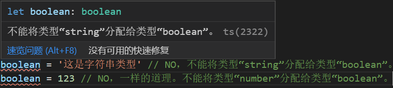
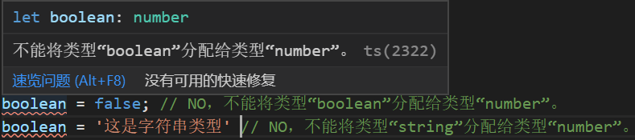
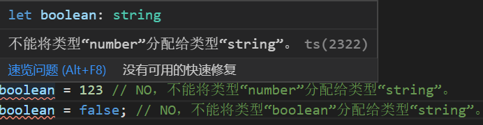

## Boolean 类型

在变量名后面定义了布尔值数据类型，即代表当前变量只能为此数据类型的数据，一旦定义其他数据类型，就会出现下方的错误警告。

```ts
// Boolean 类型
let boolean: boolean;
boolean = true; // OK
boolean = false; // OK
boolean = "这是字符串类型"; // NO，不能将类型“string”分配给类型“boolean”。
boolean = 123; // NO。不能将类型“number”分配给类型“boolean”。
```



## Number 类型

在变量名后面定义了数字数据类型，即代表当前变量只能为此数据类型的数据，一旦定义其他数据类型，就会出现下方的错误警告。

```ts
// Number 类型
let boolean: number;
boolean = 123;
boolean = false; // NO，不能将类型“boolean”分配给类型“number”。
boolean = "这是字符串类型"; // NO，不能将类型“string”分配给类型“number”。
```



## String 类型

在变量名后面定义了字符串数据类型，即代表当前变量只能为此数据类型的数据，一旦定义其他数据类型，就会出现下方的错误警告。

```ts
// String 类型
let boolean: string;
boolean = "这是字符串类型";
boolean = 123; // NO，不能将类型“number”分配给类型“string”。
boolean = false; // NO，不能将类型“boolean”分配给类型“string”。
```



## Symbol 类型

`symbol` 类型是 es6 新增的一个基本数据类型,表示独一无二的值，最大的用法是用来定义对象的唯一属性名。

```ts
// Symbol 类型
let symbol = Symbol("key");
let symbol1 = Symbol("key");
symbol = "这是字符串类型"; // NO，不能将类型“string”分配给类型“symbol”。

console.log(symbol1); // Symbol(key)
// 就算你给symbol和symbol1定义的值一样，但根据它们两个的特性，所以也不会相等。
console.log(symbol === symbol1); // false，因为Symbol类型是不可改变且唯一的

let symbol3 = Symbol();
let symbol4 = Symbol("value");
let obj = {
  symbol3: symbol4,
};
console.log(obj.symbol3); // Symbol(value)
console.log(symbol3 === symbol4); // false，就算通过对象传值，最终也不相等。
```

注：

其实在你刚开始学习 `TypeScript` 的时候，你与 `JavaScript` 对比，会觉得 `TypeScript` 是个什么玩意这么麻烦，还不如 `JavaScript` 轻松简单。但是 `TypeScript` 有着 `JavaScript` 无法比拟的优势。

**1.静态输入**

当你在写代码的时候，ts 就能够自动显示出你代码中有问题的地方，尽管有警告，但是依然能够成功编译代码。那么 `TypeScript` 的作用很明显，就是提高你编写代码的规范，以便使得代码质量更好、更清晰。

**2.大型的开发项目**

在你写一些小 demo 的时候，可能它的作用还不是特别显著，但是当你面对一些大型项目的时候，有时为了改进开发项目，需要对代码库进行小的增量更改。这些小小的变化可能会产生严重的、意想不到的后果，因此有必要撤销这些变化。使用 `TypeScript` 工具来进行重构更变的容易、快捷。

**3.更好的协作**

当发开大型项目时，会有许多开发人员，此时乱码和错误的机也会增加。类型安全是一种在编码期间检测错误的功能，而不是在编译项目时检测错误。这为开发团队创建了一个更高效的编码和调试过程。

**4.更强的生产力**

干净的 ECMAScript 6 代码，自动完成和动态输入等因素有助于提高开发人员的工作效率。这些功能也有助于编译器创建优化的代码。

## 参考文档

[Typescript 和 Javascript 之间的区别](https://www.cnblogs.com/langzianan/p/8403332.html)

[Typescript 中文文档](https://www.tslang.cn/docs/handbook/basic-types.html)

[深入理解 Typescript](https://jkchao.github.io/typescript-book-chinese)

[TypeScript symbol 类型](https://www.cnblogs.com/fanqisoft/p/11935846.html)
