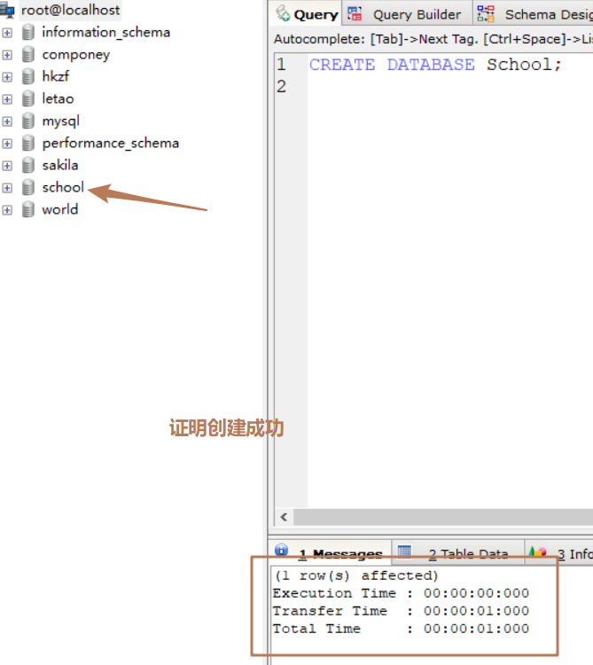
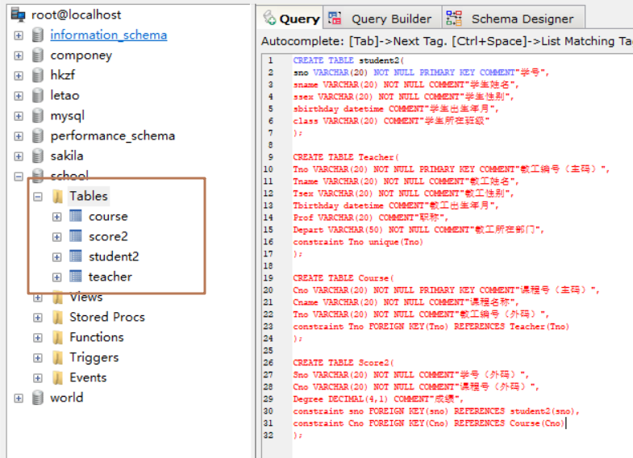
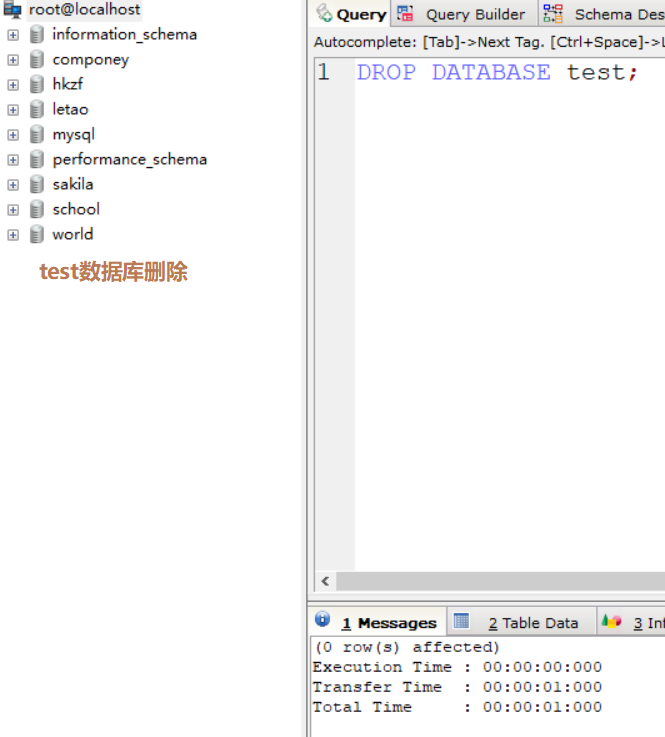
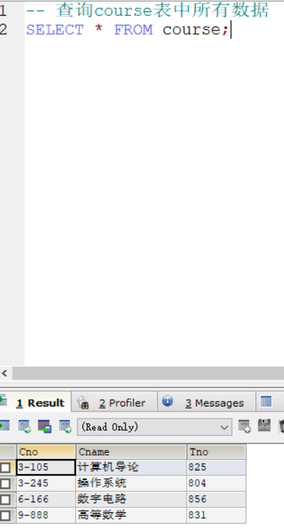
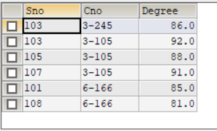
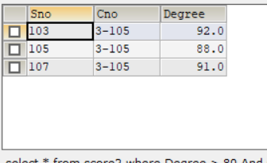
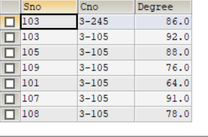
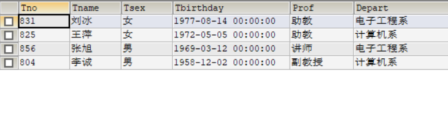
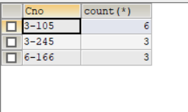

## sql 创建数据库

`语法：CREATE DATABASE 数据库名`;

**创建一个 school 的数据库**

```sql
CREATE DATABASE school;
```



**给 school 数据库创建数据表**

`语法：CREATE TABLE table_name (column_name column_type);`

- 如果你不想字段为 **NULL** 可以设置字段的属性为 **NOT NULL**， 在操作数据库时如果输入该字段的数据为**NULL** ，就会报错。
- AUTO_INCREMENT 定义列为自增的属性，一般用于主键，数值会自动加 1。
- PRIMARY KEY 关键字用于定义列为主键。 您可以使用多列来定义主键，列间以逗号分隔。
- ENGINE 设置存储引擎，CHARSET 设置编码。

```sql
版块执行顺序：1342

CREATE TABLE student2(
  sno VARCHAR(20) NOT NULL PRIMARY KEY COMMENT"学号",
  sname VARCHAR(20) NOT NULL COMMENT"学生姓名",
  ssex VARCHAR(20) NOT NULL COMMENT"学生性别",
  sbirthday datetime COMMENT"学生出生年月",
  class VARCHAR(20) COMMENT"学生所在班级"
);

CREATE TABLE Teacher(
  Tno VARCHAR(20) NOT NULL PRIMARY KEY COMMENT"教工编号（主码）",
  Tname VARCHAR(20) NOT NULL COMMENT"教工姓名",
  Tsex VARCHAR(20) NOT NULL COMMENT"教工性别",
  Tbirthday datetime COMMENT"教工出生年月",
  Prof VARCHAR(20) COMMENT"职称",
  Depart VARCHAR(50) NOT NULL COMMENT"教工所在部门",
  constraint Tno unique(Tno)
);

CREATE TABLE Course(
  Cno VARCHAR(20) NOT NULL PRIMARY KEY COMMENT"课程号（主码）",
  Cname VARCHAR(20) NOT NULL COMMENT"课程名称",
  Tno VARCHAR(20) NOT NULL COMMENT"教工编号（外码）",
  constraint Tno FOREIGN KEY(Tno) REFERENCES Teacher(Tno)
);

CREATE TABLE Score2(
  Sno VARCHAR(20) NOT NULL COMMENT"学号（外码）",
  Cno VARCHAR(20) NOT NULL COMMENT"课程号（外码）",
  Degree DECIMAL(4,1) COMMENT"成绩",
  constraint sno FOREIGN KEY(sno) REFERENCES student2(sno),
  constraint Cno FOREIGN KEY(Cno) REFERENCES Course(Cno)
);
```



**给各个表添加数据**

`语法：INSERT INTO <表名> VALUES ( value1, value2,...valueN );`

```sql
版块执行顺序：1423

INSERT INTO student2 VALUES(108,"曾华","男",19770901,95033);
INSERT INTO student2 VALUES(105,"匡明","男",19751002,95031);
INSERT INTO student2 VALUES(107,"王丽","女",19760123,95033);
INSERT INTO student2 VALUES(101,"李军","男",19760220,95033);
INSERT INTO student2 VALUES(109,"王芳","女",19750210,95031);
INSERT INTO student2 VALUES(103,"陆君","男",19740603,95031);

INSERT INTO course VALUES ("3-105","计算机导论",825);
INSERT INTO course VALUES ("3-245","操作系统",804);
INSERT INTO course VALUES ("6-166","数字电路",856);
INSERT INTO course VALUES ("9-888","高等数学",831);

INSERT INTO score2 VALUES(103,"3-245",86 );
INSERT INTO score2 VALUES(105,"3-245",75 );
INSERT INTO score2 VALUES(109,"3-245",68 );
INSERT INTO score2 VALUES(103,"3-105",92 );
INSERT INTO score2 VALUES(105,"3-105",88 );
INSERT INTO score2 VALUES(109,"3-105",76 );
INSERT INTO score2 VALUES(101,"3-105",64 );
INSERT INTO score2 VALUES(107,"3-105",91 );
INSERT INTO score2 VALUES(108,"3-105",78 );
INSERT INTO score2 VALUES(101,"6-166",85 );
INSERT INTO score2 VALUES(107,"6-166",79 );
INSERT INTO score2 VALUES(108,"6-166",81 );

INSERT INTO teacher VALUES(804,"李诚","男",19581202,"副教授","计算机系");
INSERT INTO teacher VALUES(856,"张旭","男",19690312,"讲师","电子工程系");
INSERT INTO teacher VALUES(825,"王萍","女",19720505,"助教","计算机系");
INSERT INTO teacher VALUES(831,"刘冰","女",19770814,"助教","电子工程系");
```

## sql 删除数据库

`语法：drop database <数据库名>;`

**目前有一个 test 数据库，将其删除**

```sql
DROP DATABASE test;
```



**删除数据表**

`语法：DROP TABLE <数据表名>;`

## sql 数据类型

### 数值类型

这些类型包括严格数值数据类型(INTEGER、SMALLINT、DECIMAL 和 NUMERIC)，以及近似数值数据类型(FLOAT、REAL 和 DOUBLE PRECISION)。

关键字 INT 是 INTEGER 的同义词，关键字 DEC 是 DECIMAL 的同义词。

BIT 数据类型保存位字段值，并且支持 MyISAM、MEMORY、InnoDB 和 BDB 表。

作为 SQL 标准的扩展，sql 也支持整数类型 TINYINT、MEDIUMINT 和 BIGINT。下面的表显示了需要的每个整数类型的存储和范围。

| 类型           | 大小                                          | 范围（有符号）                                                                                                                      | 范围（无符号）                                                    | 用途            |
| -------------- | --------------------------------------------- | ----------------------------------------------------------------------------------------------------------------------------------- | ----------------------------------------------------------------- | --------------- |
| TINYINT        | 1 Bytes                                       | (-128，127)                                                                                                                         | (0，255)                                                          | 小整数值        |
| SMALLINT       | 2 Bytes                                       | (-32 768，32 767)                                                                                                                   | (0，65 535)                                                       | 大整数值        |
| MEDIUMINT      | 3 Bytes                                       | (-8 388 608，8 388 607)                                                                                                             | (0，16 777 215)                                                   | 大整数值        |
| INT 或 INTEGER | 4 Bytes                                       | (-2 147 483 648，2 147 483 647)                                                                                                     | (0，4 294 967 295)                                                | 大整数值        |
| BIGINT         | 8 Bytes                                       | (-9,223,372,036,854,775,808，9 223 372 036 854 775 807)                                                                             | (0，18 446 744 073 709 551 615)                                   | 极大整数值      |
| FLOAT          | 4 Bytes                                       | (-3.402 823 466 E+38，-1.175 494 351 E-38)，0，(1.175 494 351 E-38，3.402 823 466 351 E+38)                                         | 0，(1.175 494 351 E-38，3.402 823 466 E+38)                       | 单精度 浮点数值 |
| DOUBLE         | 8 Bytes                                       | (-1.797 693 134 862 315 7 E+308，-2.225 073 858 507 201 4 E-308)，0，(2.225 073 858 507 201 4 E-308，1.797 693 134 862 315 7 E+308) | 0，(2.225 073 858 507 201 4 E-308，1.797 693 134 862 315 7 E+308) | 双精度 浮点数值 |
| DECIMAL        | 对 DECIMAL(M,D) ，如果 M>D，为 M+2 否则为 D+2 | 依赖于 M 和 D 的值                                                                                                                  | 依赖于 M 和 D 的值                                                | 小数值          |

### 日期和时间类型

表示时间值的日期和时间类型为 DATETIME、DATE、TIMESTAMP、TIME 和 YEAR。

每个时间类型有一个有效值范围和一个"零"值，当指定不合法的 sql 不能表示的值时使用"零"值。

TIMESTAMP 类型有专有的自动更新特性，将在后面描述

| 类型      | 大小（bytes） | 范围                                                                                                                                    | 格式                | 用途                     |
| --------- | ------------- | --------------------------------------------------------------------------------------------------------------------------------------- | ------------------- | ------------------------ |
| DATE      | 3             | 1000-01-01/9999-12-31                                                                                                                   | YYYY-MM-DD          | 日期值                   |
| TIME      | 3             | '-838:59:59'/'838:59:59'                                                                                                                | HH:MM:SS            | 时间值或持续时间         |
| YEAR      | 1             | 1901/2155                                                                                                                               | YYYY                | 年份值                   |
| DATETIME  | 8             | 1000-01-01 00:00:00/9999-12-31 23:59:59                                                                                                 | YYYY-MM-DD HH:MM:SS | 混合日期和时间值         |
| TIMESTAMP | 4             | 1970-01-01 00:00:00/2038 结束时间是第 **2147483647** 秒，北京时间 **2038-1-19 11:14:07**，格林尼治时间 2038 年 1 月 19 日 凌晨 03:14:07 | YYYYMMDD HHMMSS     | 混合日期和时间值，时间戳 |

### 字符串类型

字符串类型指 CHAR、VARCHAR、BINARY、VARBINARY、BLOB、TEXT、ENUM 和 SET。该节描述了这些类型如何工作以及如何在查询中使用这些类型。

| 类型       | 大小                  | 用途                            |
| ---------- | --------------------- | ------------------------------- |
| CHAR       | 0-255 bytes           | 定长字符串                      |
| VARCHAR    | 0-65535 bytes         | 变长字符串                      |
| TINYBLOB   | 0-255 bytes           | 不超过 255 个字符的二进制字符串 |
| TINYTEXT   | 0-255 bytes           | 短文本字符串                    |
| BLOB       | 0-65 535 bytes        | 二进制形式的长文本数据          |
| TEXT       | 0-65 535 bytes        | 长文本数据                      |
| MEDIUMBLOB | 0-16 777 215 bytes    | 二进制形式的中等长度文本数据    |
| MEDIUMTEXT | 0-16 777 215 bytes    | 中等长度文本数据                |
| LONGBLOB   | 0-4 294 967 295 bytes | 二进制形式的极大文本数据        |
| LONGTEXT   | 0-4 294 967 295 bytes | 极大文本数据                    |

**注意**：

char(n) 和 varchar(n) 中括号中 n 代表字符的个数，并不代表字节个数，比如 CHAR(30) 就可以存储 30 个字符。

## sql 查询数据

`语法：SELECT <查询数据> FROM <数据所在>`

- 查询语句中你可以使用一个或者多个表，表之间使用逗号(,)分割，并使用 WHERE 语句来设定查询条件。
- SELECT 命令可以读取一条或者多条记录。
- 你可以使用星号（\*）来代替其他字段，SELECT 语句会返回表的所有字段数据

```sql
-- 查询course表中所有数据
SELECT * FROM course;
```



## sql WHERE 子句

如需有条件地从表中选取数据，可将 WHERE 子句添加到 SELECT 语句中。

`语法：SELECT <查询范围> FROM <数据表> [WHERE <条件1> [AND [OR]] <条件2>...]`

```sql
-- 查询Degree大于80的都有哪些班级
SELECT * FROM score2 WHERE Degree > 80;
```



```sql
-- 查询Degree大于80并且cno为3-105的都有哪些
SELECT * FROM score2 WHERE Degree > 80 AND Cno = '3-105';
```



```sql
-- 查询Degree大于80或者cno为3-105的都有哪些
SELECT * FROM score2 WHERE Degree > 80 OR Cno = '3-105';
```



## sql 排序

如果我们需要对读取的数据进行排序，我们就可以使用 sql 的 **ORDER BY** 子句来设定你想按哪个字段哪种方式来进行排序，再返回搜索结果。

你可以使用 ASC 或 DESC 关键字来设置查询结果是按升序或降序排列。 默认情况下，它是按升序排列。

`语法：SELECT <查询范围> FROM <查询表> ORDER BY <条件> [ASC默认][DESC]`

```sql
-- 查询教师，按照降序排序(默认是升序)
SELECT * FROM teacher ORDER BY Tbirthday DESC;
```



## sql 分组

GROUP BY 语句根据一个或多个列对结果集进行分组。

`语法：SELECT <查询范围> FROM <数据表> GROUP BY <分组列表>;`

```sql
-- 查询score2，按照Cno进行分组，计算Cno出现的次数
SELECT Cno,COUNT(*) FROM score2 GROUP BY Cno;
```


