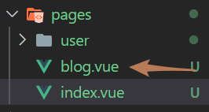

`Nuxt.js` 是一个基于 `Vue.js` 的通用应用框架。

如果单纯创建一个 `vue` 的项目，他所展示的页面代码我们无法查看其源代码，因为它所展示的页面是通过客户端渲染的。而由 `Nuxt` 创建的项目页面能够查看到其源代码，因为它所展示的页面是通过服务端渲染的。

## 服务端渲染

DOM 树在服务端生成，然后返回给前端。

**服务端渲染的优点**：

1、尽量不占用前端的资源，前端这块耗时少，速度快。

2、有利于 `SEO` 优化，因为在后端有完整的 `html` 页面，所以爬虫更容易爬取信息。

**服务端渲染的缺点**：

1、不利于前后端分离，开发的效率降低了。

2、对 `html` 的解析，对前端来说加快了速度，但是加大了服务器的压力。

## 客户端渲染（SSR）

前端去后端取数据生成 DOM 树。

**客户端渲染的优点**：

1、前后端分离，开发效率高。

2、用户体验更好，我们将网站做成 SPA（单页面应用）或者部分内容做成 SPA，当用户点击时，不会形成频繁的跳转。

**客户端渲染的缺点**：

1、前端响应速度慢，特别是首屏，这样用户是受不了的。

2、不利于 `SEO` 优化，因为爬虫不认识 `SPA`，所以它只是记录了一个页面。

## Nuxt 基本页面构造

1.布局页面：它默认放在 `layouts/default.vue` 文件中，它是所有页面的基础

2.页面：放在 pages 中

3.页面组件：页面中的细节，或者版块，用页面组件来写

## Nuxt 基本渲染(合理运用三个基本构造)

layouts/default.vue

```vue
<template>
  <div>
    <Nuxt />
  </div>
</template>

<script>
export default {};
</script>

<style></style>
```

pages/index.vue

```vue
<template>
  <div>
    <b>首页历史人物姓名总结：</b>
    <People></People>
  </div>
</template>

<script>
export default {};
</script>
```

components/People.vue

```vue
<template>
  <div>
    <ul>
      <li>曹操</li>
      <li>曹贼</li>
      <li>曹阿瞒</li>
    </ul>
  </div>
</template>

<script>
export default {};
</script>

<style></style>
```

## Nuxt 手动页面跳转




由图可见，只需将 url 地址进行手动修改，便能够成功跳转

## 参考文档

[客户端渲染和服务端渲染的区别](https://www.cnblogs.com/wuqilang/p/11202475.html)
