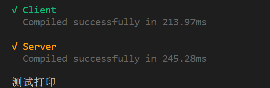
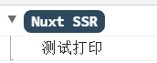
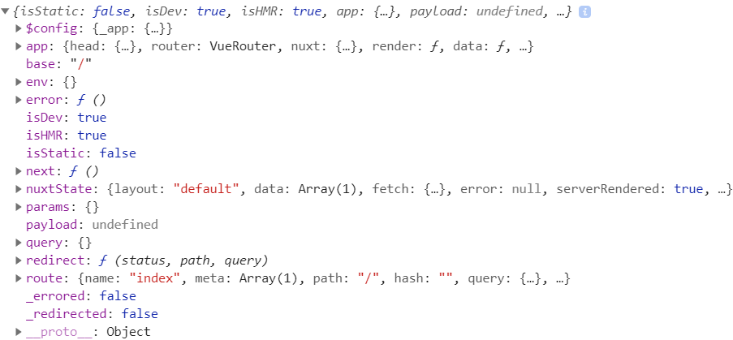
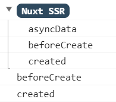
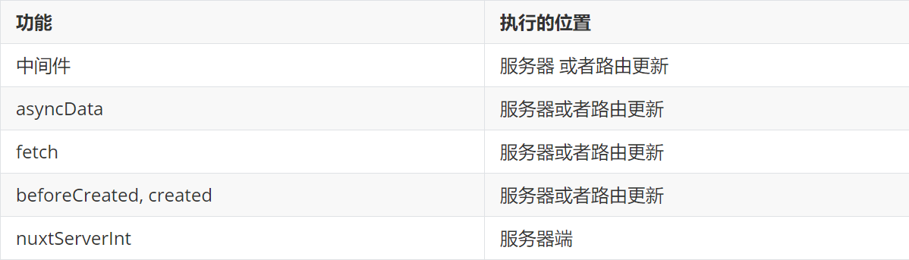

Nuxt.js 扩展了 Vue.js，增加了一个叫 `asyncData` 的方法，使得我们可以在设置组件的数据之前能异步获取或处理数据。

## asyncData 函数特点和使用方法

### 知识介绍

#### 1.只能用在页面文件中(page 目录下的文件中)





**pages/index.vue**

```vue
<template>
  <div>
    <h3>首页</h3>
    <test></test>
  </div>
</template>

<script>
import test from "../components/test.vue";

export default {
  asyncData() {
    // 第一次进入页面时，"测试打印"在终端中显示
    console.log("测试打印");
  },
  components: {
    test,
  },
};
</script>
```

**components/test.vue**

```vue
<template>
  <div>用来测试的index组件</div>
</template>

<script>
export default {
  data() {
    return {};
  },
  asyncData() {
    // 跑后正如官网所说，页面中asyncData函数能够实现
    // 组件中asyncData不起作用
    console.log("test组件中的asyncData");
  },
};
</script>

<style></style>
```

#### 2.它可以在服务端或路由更新之前被调用

(1) asnycData 函数默认在服务端渲染

(2) asnycData 函数在当前所在页面刷新后在服务端渲染

(3) asyncData 函数在路由跳转时在客户端渲染

#### 3.return 返回的数据，这个数据可以在页面中使用

```vue
<template>
  <div>
    <h3>首页</h3>
    <span>{{ name }}</span>

    <nuxt-link to="/about">点击跳转到关于页面</nuxt-link>
  </div>
</template>

<script>
export default {
  asyncData(aa) {
    return {
      name: "曹操",
    };
  },
  data() {
    return {};
  },
};
</script>
```

#### 4.有很多参数： 比如 query, params ,route 等



```vue
<template>
  <div>
    <h3>首页</h3>

    <nuxt-link to="/about">点击跳转到关于页面</nuxt-link>
  </div>
</template>

<script>
export default {
  asyncData(aa) {
    // asyncData函数的第一个参数中含有很多的参数
    // 在初始化时第一次进入该页面，该函数所打印出来的第一个参数为服务端的数据
    // 若经过路由跳转等操作后，打印出来的数据为客户端数据
    console.log(aa);
  },
  data() {
    return {};
  },
};
</script>
```

#### 5.在获取页面初始化异步数据时使用

**pages/index.vue**

```vue
<template>
  <div>
    <h3>首页</h3>
    <ul>
      <li v-for="item in list" :key="item.id">{{ item.title }}</li>
    </ul>

    <nuxt-link to="/about">点击跳转到关于页面</nuxt-link>
  </div>
</template>

<script>
import axios from "axios";

export default {
  async asyncData() {
    // 第一种方式，解构赋值
    let {
      data: { data },
    } = await axios.get("https://cnodejs.org/api/v1/topics");

    return {
      list: data,
    };
  },
  data() {
    return {};
  },
};
</script>
```

**pages/about.vue**

```vue
<template>
  <div>
    <h3>关于</h3>
    <button @click="handleGetTopics">点击获取数据</button>

    <ul>
      <li v-for="item in topicsList" :key="item.id">{{ item.title }}</li>
    </ul>

    <nuxt-link to="/">返回到首页</nuxt-link>
  </div>
</template>

<script>
import axios from "axios";

export default {
  // 虽说asyncData()要先于实例的创建，但是
  // 经过路由跳转之后，asyncData()return的东西将会和data合并
  asyncData() {
    return {
      topicsList: [],
    };
  },
  methods: {
    handleGetTopics() {
      console.log(11);
      // 第二种方式
      axios.get("https://cnodejs.org/api/v1/topics").then((res) => {
        this.topicsList = res.data.data;
      });
    },
  },
};
</script>

<style></style>
```

#### 6.asyncData 函数比 vue 的生命周期函数更快



```vue
<template>
  <div></div>
</template>

<script>
import axios from "axios";

export default {
  asyncData() {
    console.log("asyncData");
  },
  data() {
    return {};
  },
  beforeCreate() {
    console.log("beforeCreate");
  },
  created() {
    console.log("created");
  },
};
</script>
```


