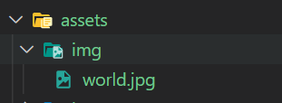
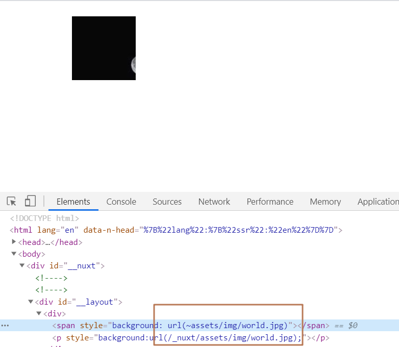
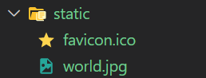

## 使用css/html预处理器

**先安装这包才能够识别less，scss后缀**

yarn add -D @nuxtjs/style-resources

### less/scss

**less安装包**

yarn add less less-loader@7.3.0

**scss安装包**

yarn add -D sass sass-loader@10

**nuxt.config.js 配置文件**

```js
// Global CSS: https://go.nuxtjs.dev/config-css
css: ['~/assets/less/base.less', '~/assets/scss/base.scss'],

// global style resources 配置全局less变量
styleResources: {
  less: ['~/assets/less/variable.less'],
  scss: ['~/assets/scss/variable.scss']
},
    
// Modules for dev and build (recommended): https://go.nuxtjs.dev/config-modules
// 在原本nuxt.config.js中就有该属性，无需自己添加，需注意
buildModules: [
  '@nuxtjs/style-resources'
],
```

**assets/less/variable.less 放置less全局变量文件**

```less
// less的变量前缀为  @
@allColor: skyblue;
```

**assets/scss/variable.scss 放置scss全局变量文件**

```scss
$colorData: yellowgreen;
```

**assets/less/base.less 使用less全局变量文件**

```less
h1 {
  // 使用全局less变量
  color: @allColor;
}
```

**assets/scss/base.scss 使用scss全局变量文件**

```scss
h2 {
  color: $colorData;
}
```

**index.vue 查看效果**

```vue
<template>
  <div>
    <h1>Hello Less</h1>
    <h2>Hello Scss</h2>
  </div>
</template>

<script>
export default {
  data() {
    return {};
  },
};
</script>

<style>
</style>
```


### 静态资源文件目录

在Nuxt.js中静态资源文件分为两类，一类是需要webpack处理的，另外一类是不需要webpack处理的，它们的存放目录是不一样的。

#### assets目录

assets目录下的图片，less，scss等资源会被webpack编译。

行内样式使用图片时，不会被webpack编译，需要手动使用require加载图片

 

##### 使用img显示图片 

```vue
<template>
  <div>
    <!-- img标签显示图片 -->
    <!-- 官方文档上说nuxt2.0版本后url路径要用~/xxx的方式 -->
    

    <!-- ~/alias将无法在CSS文件中正确解析，但经过测试，依然能够使用 -->
    <!-- 因此感觉会有点小问题，因为有所冲突了 -->
    

    <!-- @的作用跟~相同，都能查看到根目录 -->
    <!-- 官方文档中说能使用，看了其他博客都说推荐 -->
    
  </div>
</template>

<script>
export default {
  data() {
    return {};
  },
};
</script>

<style>
</style>
```

##### 使用类名显示图片

```vue
<template>
  <div>
    <!-- 使用类名显示图片 -->
    <span class="active"></span>
  </div>
</template>

<script>
export default {
  data() {
    return {};
  },
};
</script>

<style>
/* 图片能出来就行，样式如何别太管 */
.active {
  display: inline-block;
  width: 100px;
  height: 100px;
  background: url(~assets/img/world.jpg);
  background-size: 100%;

  /* 不能够使用@，会出问题，@可以用在url路径中，样式中别用 */
  /* background: url(@assets/img/world.jpg); */
}
</style>
```

##### 使用行内样式显示图片

 

```vue
<template>
  <div>
    <!-- 使用行内样式显示图片 -->
    <!-- 在行内样式中，像之前在url路径或者在内部样式是行不通的，因为无法编译这路径 -->
    <span style="background: url(~assets/img/world.jpg)"></span>

    <!-- 所以换一种写法，将其变成一个活数据 -->
    <p :style="opStyle"></p>
  </div>
</template>

<script>
export default {
  data() {
    return {
      // 这里也有个问题，怕是中文官网的问题，说要用~assets的方式
      // 但是这里用这方式就会报错，要用~/assets的方式才行，@同样也不行
      opStyle: `background: url(${require("~/assets/img/world.jpg")})`,
    };
  },
};
</script>

<style>
span,
p {
  display: inline-block;
  width: 100px;
  height: 100px;
}
</style>
```

#### static目录

Nuxt直接使用资源文件，不做任何处理

 

##### 使用img标签显示图片

```vue
<template>
  <div>
    <!-- 使用img标签显示图片 -->
    <!-- 直接就可以找到此图片 -->
    
  </div>
</template>

<script>
export default {
  data() {
    return {};
  },
};
</script>

<style>
</style>
```

##### 使用类名显示图片

```vue
<template>
  <div>
    <!-- 使用类名显示图片 -->
    <span class="active"></span>
  </div>
</template>

<script>
export default {
  data() {
    return {};
  },
};
</script>

<style>
.active {
  display: inline-block;
  width: 100px;
  height: 100px;
  background: url(/world.jpg);
  background-size: 100%;
}
</style>
```

##### 使用行内样式显示图片

```vue
<template>
  <div>
    <!-- 使用行内样式显示图片 -->
    <!-- 其实assets跟static在使用上很像，只是性质和特点不同而已 -->
    <p :style="opStyle"></p>
  </div>
</template>

<script>
export default {
  data() {
    return {
      // 注意，在data中路径必须要写完整，因为他跟模板不一样
      opStyle: `background: url(${require("~/static/world.jpg")})`,
    };
  },
};
</script>

<style>
span,
p {
  display: inline-block;
  width: 100px;
  height: 100px;
}
</style>
```

