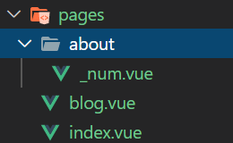
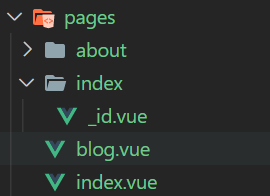
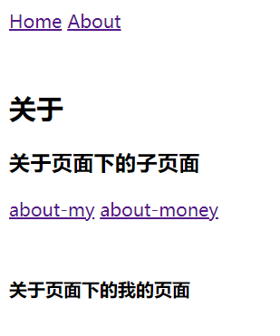
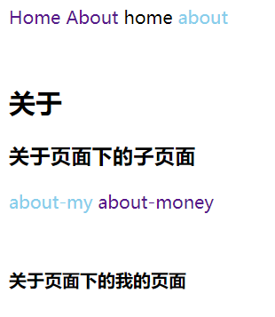

## 路由跳转

```vue
<template>
  <div>
    <!-- 相当于vue中的vue-router -->
    <nuxt-link to="/blog"><b>前往博客页面</b></nuxt-link>
    <nuxt-link to="/"><b>前往首页</b></nuxt-link>

    <Nuxt />
  </div>
</template>

<script>
export default {

}
</script>

<style>
/* 每个nuxt-link在页面中都有两个默认类名 */
/* nuxt-link-exact-active nuxt-link-active */
/* 可以以下面的形式使用a的类名，对a进行切换时样式的改变 */
a.nuxt-link-exact-active {
  color: skyblue;
}
</style>
```


## 路由传值

最简单的路由传值

 

**pages/blog.vue**

```vue
<template>
  <div>
    <h3>这是一个博客页面</h3>
    
    <nuxt-link to="/about/111">传送参数</nuxt-link>
  </div>
</template>

<script>
export default {

}
</script>

<style>

</style>
```

**pages/about/_num.vue**

```vue
<template>
  <p>
    <!-- 得到{ "num": "111" } -->
    <!-- 代表，当点击了blog中的按钮后，随着数据的传入 -->
    <!-- 数据的属性名的等于传入对应文件的名字 -->
    <!-- 但前提必须要有'_' -->
    {{ $route.params }}
    <b>接受传来的数据：{{ $route.params.num }}</b>
  </p>
</template>

<script>
export default {

}
</script>

<style>

</style>
```

有点绕的路由传值

 

**layouts/default.vue**

```vue
<template>
  <div>
    <!-- 效果：在index中传值，然后成功获取 -->
    <nuxt-link to="/3000"><b>前往首页</b></nuxt-link>
    <nuxt-link to="/blog"><b>前往博客页面</b></nuxt-link>

    <Nuxt />
  </div>
</template>

<script>
export default {};
</script>

<style>
/* 每个nuxt-link在页面中都有两个默认类名 */
/* nuxt-link-exact-active nuxt-link-active */
/* 可以以下面的形式使用a的类名，对a进行切换时样式的改变 */
a.nuxt-link-exact-active {
  color: skyblue;
}
</style>
```

**pages/index.vue**

```vue
<template>
  <div>
    <b>首页历史人物姓名总结：</b>
    <People></People>
  </div>
</template>

<script>
export default {}
</script>
```

**components/People.vue**

```vue
<template>
  <div>
    <ul>
      <li>曹操</li>
      <li>曹贼</li>
      <li>曹阿瞒</li>
    </ul>

    <!-- 这里并没有搞懂，数据只是再index文件夹内经过了一圈，得到了3000的属性名为id -->
    <!-- 然后将输出的值放在了index.vue中，然而_id.vue内的东西却不能显示 -->
    <!-- 但是想要的效果也实现了 -->
    <b>{{ $route.params.id }}</b>
  </div>
</template>

<script>
export default {};
</script>

<style>
</style>
```


## 查询参数

**pages/inquiry.vue**

```vue
<template>
  <div>
    <nuxt-link to="/login?id='123456'">查询参数</nuxt-link>
  </div>
</template>

<script>
export default {

}
</script>

<style>

</style>
```

**pages/login/index.vue**

```vue
<template>
  <!-- 这里文件的命名就无需跟路由传参一样一定要'_XXX'，也可以用index.vue -->
  <!-- 因为他要找login的主页，所以其他的写法会出错， -->
  <!-- 查询参数要用query -->
  <b>{{ $route.query }}</b>
</template>

<script>
export default {};
</script>

<style>
</style>
```


## 嵌套路由

### 简单实现嵌套路由效果

 

**layouts/default.vue**

```vue
<template>
  <div>
    <!-- 切换页面 -->
    <nuxt-link to="/">Home</nuxt-link>
    <nuxt-link to="/about">About</nuxt-link>

    <div style="margin-top: 50px">
      <Nuxt />
    </div>
  </div>
</template>

<script>
export default {};
</script>

<style>
</style>
```

**pages/index.vue**

```vue
<template>
  <div>
    <h2>首页</h2>
  </div>
</template>

<script>
export default {};
</script>
```

**pages/about.vue**

```vue
<template>
  <div>
    <h2>关于</h2>

    <div>
      <h3>关于页面下的子页面</h3>

      <nuxt-link to="/about/my">about-my</nuxt-link>
      <nuxt-link to="/about/money">about-money</nuxt-link>

      <div style="margin-top: 50px">
        <!-- 用来放置当前页面下的子页面 -->
        <nuxt-child />
      </div>
    </div>
  </div>
</template>

<script>
export default {};
</script>

<style>
</style>
```

**pages/about/my.vue**

```vue
<template>
  <div>
    <b>关于页面下的我的页面</b>
  </div>
</template>

<script>
export default {};
</script>

<style>
</style>
```

**pages/about/money.vue**

```vue
<template>
  <div>
    <b>关于页面的金额页面</b>
  </div>
</template>

<script>
export default {};
</script>

<style>
</style>
```

### 完善嵌套路由的样式及点击高亮

 

**layouts/default.vue**

```vue
<template>
  <div>
    <!-- 切换页面 -->
    <!-- 原写法，无法实现想要的效果 -->
    <nuxt-link to="/">Home</nuxt-link>
    <nuxt-link to="/about">About</nuxt-link>

    <!-- 变更为用事件控制 -->
    <span :class="{ active: checked }" @click="handleChangeRoute('/')">
      home
    </span>
    <span :class="{ active: !checked }" @click="handleChangeRoute('/about')">
      about
    </span>

    <div style="margin-top: 50px">
      <Nuxt />
    </div>
  </div>
</template>

<script>
export default {
  data() {
    return {
      checked: true,
      // 暂时强制定义刚进入的页面必定是首页
      url: "/",
    };
  },
  methods: {
    // 点击改变状态，并跳转路由
    handleChangeRoute(path) {
      if (path == this.url) return;
      this.checked = !this.checked;
      this.url = path;
      this.$router.push(path);
    },
  },
};
</script>

<style>
a {
  text-decoration: none;
}

/* 这里要点击高亮了，及哪怕子路由点击也要高亮，那么这里就涉及到一个知识点 */
/* nuxt-link-exact-active 是精确匹配规则，即只有当前点击路由被匹配 */
/* nuxt-link-active 是全局匹配 即path名全包含在当前路由 path名开头的路由也会被匹配到*/
/* 因此如果要实现点击高亮及高亮保留的效果，无法单纯用类名实现 */
.nuxt-link-exact-active {
  color: skyblue;
}

.active {
  color: skyblue;
}

span {
  cursor: pointer;
}
</style>
```


## 过渡和动画

### 基础默认的路由切换过渡动画

**layouts/default.vue**

```vue
<template>
  <div>
    <!-- 切换页面，实现不同动画 -->
    <nuxt-link to="/">Home</nuxt-link>
    <nuxt-link to="/about">About</nuxt-link>

    <div style="margin-top: 50px">
      <Nuxt />
    </div>
  </div>
</template>

<script>
export default {};
</script>

<style>
/* 如果没有其他的动画，那么下面这两段样式为默认的样式 */
/* 过渡开始前和过渡结束后隐藏 */
.page-enter,
.page-leave-to {
  opacity: 0;
}
/* 过渡激活状态显示 */
.page-enter-active,
.page-leave-active {
  /* 根据opacity过渡，首先必须在上面有定义 */
  transition: opacity 0.5s;
}
</style>
```

**pages/index.vue**

```vue
<template>
  <div>
    <h2>首页</h2>
  </div>
</template>

<script>
export default {};
</script>

<style>
</style>
```

**pages/about.vue**

```vue
<template>
  <div>
    <h2>关于</h2>
  </div>
</template>

<script>
export default {};
</script>

<style>
</style>
```

### 自定义过渡效果动画

**layouts/default.vue**

```vue
<template>
  <div>
    <!-- 切换页面，实现不同动画 -->
    <nuxt-link to="/">Home</nuxt-link>
    <nuxt-link to="/about">About</nuxt-link>

    <div style="margin-top: 50px">
      <Nuxt />
    </div>
  </div>
</template>

<script>
export default {};
</script>

<style>
/* 如果没有其他的动画，那么下面这两段样式为默认的样式 */
/* 过渡开始前和过渡结束后隐藏 */
.page-enter,
.page-leave-to {
  opacity: 0;
}
/* 过渡激活状态显示 */
.page-enter-active,
.page-leave-active {
  /* 根据opacity过渡，首先必须在上面有定义 */
  transition: opacity 0.5s;
}

/* 给about页面的自定义样式动画 */
.about-enter-active {
  animation: aboutEnter 0.5s;
}
.about-leave-active {
  animation: aboutOut 0.5s;
}

/* 动画定义 */
@keyframes aboutEnter {
  from {
    transform: scale(0);
  }

  to {
    transform: scale(1);
  }
}

@keyframes aboutOut {
  from {
    transform: scale(1);
  }

  to {
    transform: scale(0);
  }
}
</style>
```

**pages/about.vue**

```vue
<template>
  <div>
    <h2>关于</h2>
    <div class="aboutbox"></div>
  </div>
</template>

<script>
export default {
  // 过渡名字必须要写，否则过渡动画效果不起作用
  transition: "about",
};
</script>

<style>
.aboutbox {
  width: 200px;
  height: 200px;
  background-color: yellowgreen;
}
</style>
```

### 页面内通过按钮实现盒子动画

**pages/index.vue**

```vue
<template>
  <div>
    <h2>首页</h2>
    <div :class="[flag ? 'active' : 'indexbox']"></div>
    <button @click="handleControl">按钮控制盒子动画</button>
  </div>
</template>

<script>
export default {
  data() {
    return {
      flag: false,
    };
  },
  methods: {
    handleControl() {
      this.flag = !this.flag;
    },
  },
};
</script>

<style>
.indexbox {
  width: 200px;
  height: 200px;
  background-color: skyblue;
  transition: all 0.5s;
}

.active {
  width: 300px;
  height: 300px;
  background-color: skyblue;
  transition: all 0.5s;
}
</style>
```

## 参考文档

[router-link-active 与 router-link-exact-active 区别，nuxt一样](https://www.cnblogs.com/mobu/p/10091043.html)