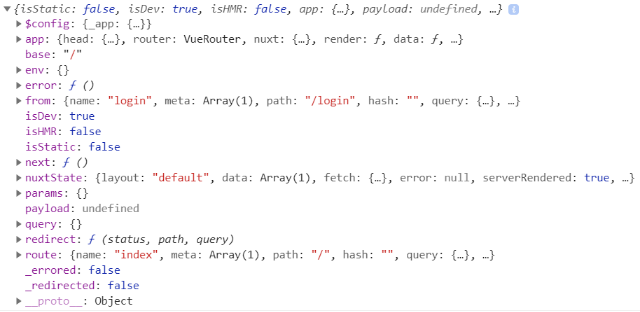
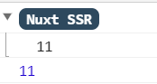
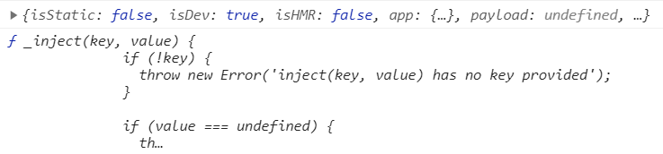

## 中间件

### 概念

所有的中间件都必须放置在 `middleware/` 目录下。

中间件可以在服务端和客户端都执行，当然也可以对其进行设置配置，让它可全局也可局部。

**layouts/default.vue**

```vue
<template>
  <div>
    <!-- 刚刷新进入页面时，会触发服务端中间件，当点击About，进行路由跳转时，触发客户端中间件 -->
    <nuxt-link to="/">Home</nuxt-link>
    <nuxt-link to="/about">About</nuxt-link>

    <div style="margin-top: 50px">
      <Nuxt />
    </div>
  </div>
</template>

<script>
export default {};
</script>

<style>
</style>
```

**middleware/baseurl.js**

```js
// 中间件函数
export default function () {
  console.log("中间件执行")
}
```

**nuxt.config.js**

```js
// 放置中间件，配置完成后可在每个页面中使用
router: {
  middleware: "baseurl"
}
```


### 设置全局中间件和局部中间件

#### 全局中间件

在加载所有的组件之前都会被自动调用。全局中间件的写法就如上面概述中一样

#### 局部中间件

在定义的组件加载之前会被自动执行。

**pages/index.vue**

```vue
<template>
  <div>
    <h2>首页</h2>
  </div>
</template>

<script>
export default {
  middleware: "baseurl",
};
</script>

<style>
</style>
```


### 中间件的实战演练

中间件的作用在于权限校验，比如登录，自我权限查询等

中间件的参数，基本上都有

 

**layouts/default.vue**

```vue
<template>
  <div>
    <!-- 刚刷新进入页面时，会触发服务端中间件，当点击About，进行路由跳转时，触发客户端中间件 -->
    <!-- 有数据的首页路由跳转 -->
    <nuxt-link to="/?username=admin&password=123456">Home1</nuxt-link>
    <!-- 没有数据的首页路由跳转 -->
    <nuxt-link to="/">Home2</nuxt-link>
    <nuxt-link to="/about">About</nuxt-link>
    <nuxt-link to="/login">Login</nuxt-link>

    <div style="margin-top: 50px">
      <Nuxt />
    </div>
  </div>
</template>

<script>
export default {};
</script>

<style>
</style>
```

**middleware/baseurl.js**

```js
// 中间件函数
export default function (context) {
  // console.log(context)
  let { query } = context
  console.log(query)
  if (query.username) {
    alert("请进来")
  } else {
    alert("用户名密码啥都没有还想进来？滚！")
    return context.redirect('/login')
  }
}
```

**pages/index.vue**

```vue
<template>
  <div>
    <h2>首页</h2>
  </div>
</template>

<script>
export default {
  // 局部中间件，能够在页面加载前执行
  middleware: "baseurl",
};
</script>

<style>
</style>
```

**pages/login.vue**

```vue
<template>
  <h2>登录</h2>
</template>

<script>
export default {};
</script>

<style>
</style>
```

**pages/about.vue**

```vue
<template>
  <div>
    <h2>关于</h2>
  </div>
</template>

<script>
export default {};
</script>

<style>
</style>
```


## 插件

`nuxt` 没有 `main.js` 文件。所以要想在根实例里面的钩子函数中添加代码就很麻烦，比如，你想添加一个监听刷新的事件，这个事件只能在根实例的钩子函数里面添加。

插件里面接收了一个context 上下文对象，对象中有 `vue` 根实例，所以你可以对根实例为所欲为，比如在根实例中添加原型，在根实例中添加全局组件，在根实例总注册全局自定义指令，等等。

插件要放在 `plugins` 中

### **会在每次刷新页面时都会在服务器和客户端执行一遍。**

 

**plugins/plug.js**

```js
export default () => {
  console.log(11)
}
```

**nuxt.config.js**

```js
// 放置插件的位置
plugins: ["~plugins/plug.js"]
```

### **客户端插件/服务端插件**

如果只在服务器端渲染只需要把mode：'server'。

如果只在客户器端渲染只需要把mode：''client'。

如果客户端和服务端都执行，设置mode：'both'

**nuxt.config.js**

```js
// 放置插件的位置（服务端）
plugins: [{
  src: "~plugins/plug.js",
  mode: "server"
}]
```

```js
// 放置插件的位置（客户端）
plugins: [{
  src: "~plugins/plug.js",
  mode: "client"
}]
```

```js
// 放置插件的位置（两端都要）也可以是上边默认的写法，也是两端都渲染
plugins: [{
  src: "~plugins/plug.js",
  mode: "both"
}]
```

### 注入插件

插件注入后，可以在整个应用程序中都可以使用，典型应用场景是 `axios` 的封装

 

插件函数有两个参数，第一个参数中包括了vue的根实例 `app` ；第二个参数返回的是一个_inject函数，其作用就是将自定义的函数交给 `nuxt`

**plugins/plug.js**

```js
import axios from "axios";

// 必须要导出，否则用不了
export default (context, inject) => {
  // 基本URL
  axios.defaults.baseURL = 'https://cnodejs.org/api/v1'

  // 自定义函数
  const getTopics = function (path) {
    return axios.get(`${path}`)
  }

  // 之前的写法，这意思是我自定义的函数名handleGetTopics等于getTopics函数
  // inject("handleGetTopics", getTopics)

  // 比较好的写法，意味将自定义的函数名为一个对象，对象里面存放着getTopics函数
  inject("handleGetTopics", { getTopics })
}
```

**pages/index.vue**

```vue
<template>
  <div>
    <h2>首页</h2>
    <ul>
      <li v-for="item in arr" :key="item.id">{{ item.title }}</li>
    </ul>
  </div>
</template>

<script>
export default {
  // 使用方式：
  // 在vue中，this.$request.函数名()
  // 在nuxt的asyncData中，content.app.$自定义函数名.函数名()
  // 因为我们要获取context里面的app，下面的形参可以将context解构
  // 当然也可以在输出的时候直接'context.app'
  async asyncData({ app }) {
    let data = await app.$handleGetTopics.getTopics("/topics");

    return {
      arr: data.data.data,
    };
  },
};
</script>

<style>
</style>
```

### Vue插件

插件注入后，可以结合```vue```进行辅助开发， 典型应用场景是```vant，element等ui库```

**plugins/vant.js**

```js
// 展示页面渲染局部vant样式
// 这里的展示可以直接看官网
import Vue from 'vue'

import { Button } from 'vant';

import 'vant/lib/index.css';

Vue.use(Button)
```

**pages/login.vue**

```vue
<template>
  <div>
    <h2>登录</h2>
    <van-button type="info">点击登录</van-button>
  </div>
</template>

<script>
export default {};
</script>

<style>
</style>
```

**nuxt.config.js**

```js
// 放置插件的位置（服务端）
plugins: ["~plugins/vant.js"]
```

## 参考文档

[对 nuxt 插件的理解](https://blog.csdn.net/qq_38296051/article/details/104020726)

[Nuxt中插件机制(整合axios示例&原理分析)](https://blog.csdn.net/weixin_44356673/article/details/107467614)

